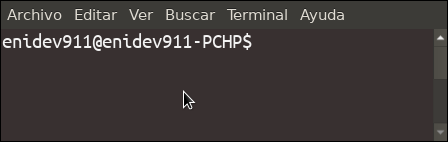
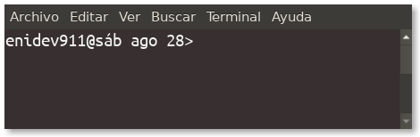
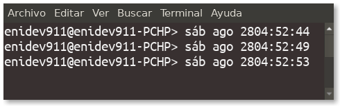

## Control del indicador

Bash examina el valor de la variable de matriz **PROMPT_COMMAND** antes de imprimir cada indicador principal


**Mostrar el nombre de usuario con el nombre host y el símbolo $ al final**

```bash
export PS1="\u@\h\\$ "
```
<p align="center">
	
</p>


**Caracteres especiales entre y después del nombre de usuario y el nombre de host**

```bash
export PS1="\u@\h> "
```
<p align="center">
	
</p>

**Mostrar fecha junto a nombre de usuario y nombre de host**

```bash
export PS1="\u@\d> "
```

<p align="center">
	
</p>


**Mostrar fecha formato hh:mm:ss junto a nombre de usuario y nombre de host**

```bash
export PS1="\u@\h> \d\t "
```

<p align="center">
	
</p>

**Le da transpariencia**

```bash
export PS1="\[\e[32;02m\]\h\[\e[m\] "
```

**La pone en italica**

```bash
export PS1="\[\e[32;03m\]\h\[\e[m\]"
```