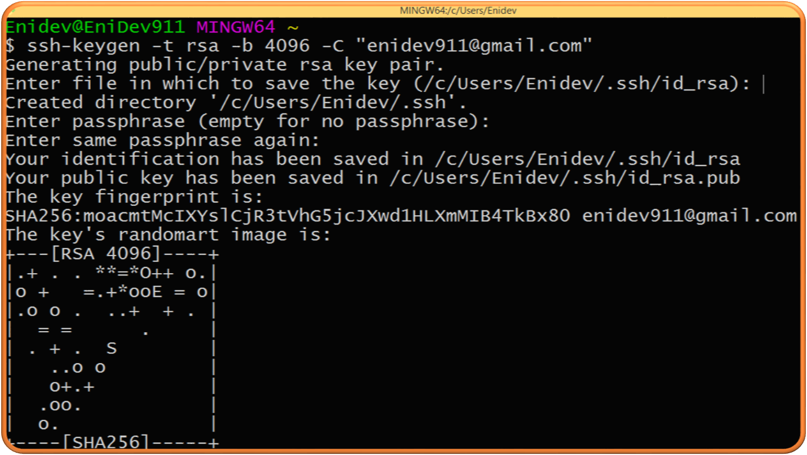
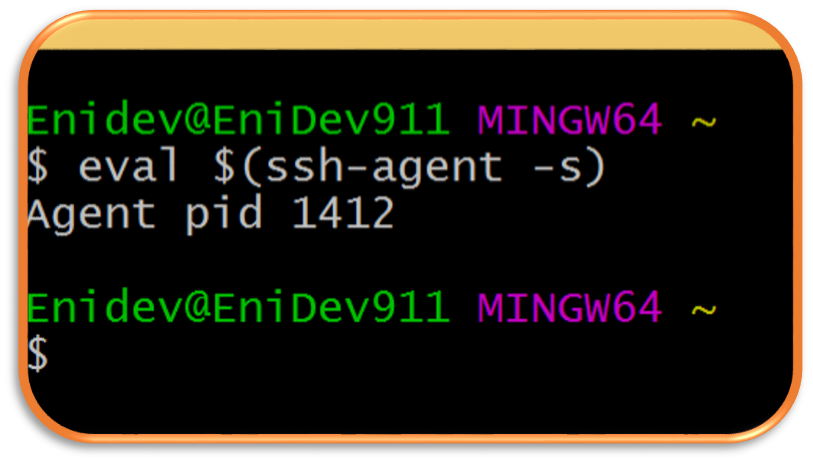
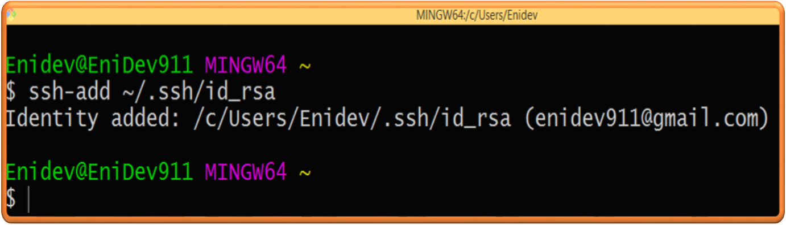
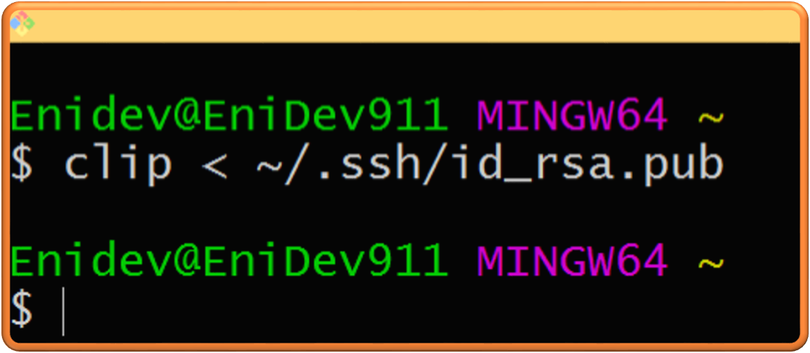
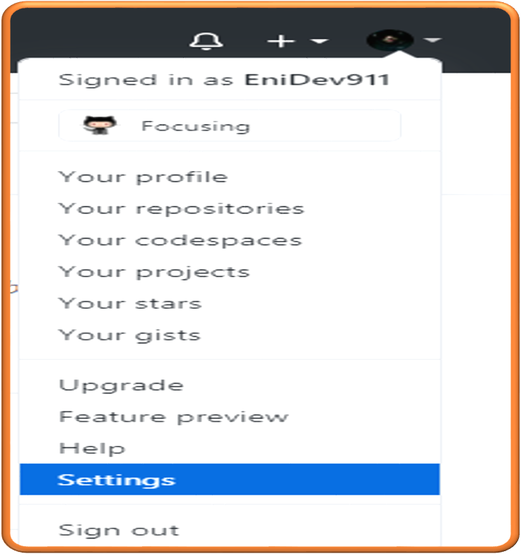
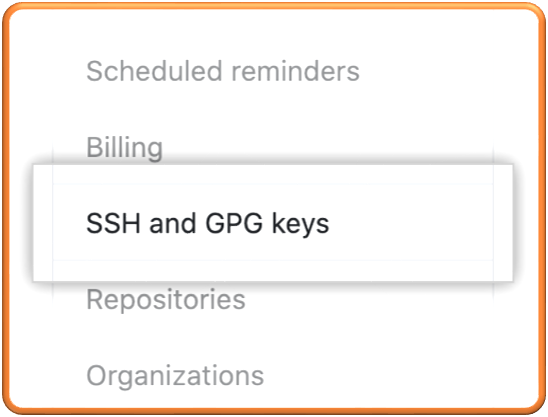
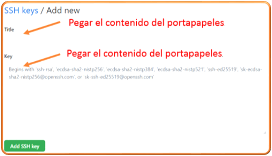
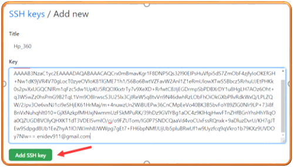
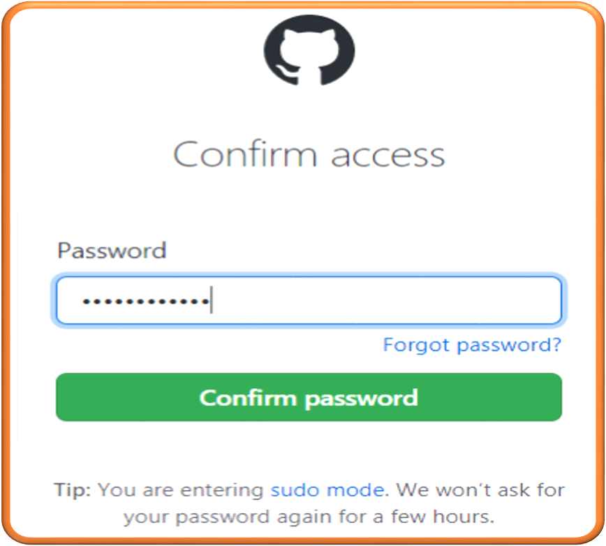
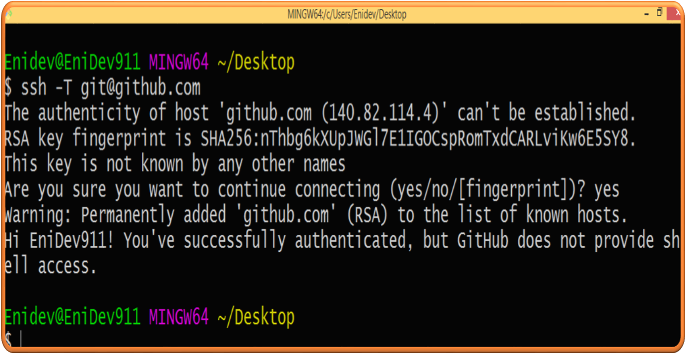

## Generar un par de claves SSH  

En la línea de comandos para Linux, Apple y en Git Bash en Windows, puede generar una clave SSH.  

Comience creando una nueva clave, usando su correo electrónico como etiqueta:

    ssh-keygen -t rsa -b 4096 -C "user@email.com"

Ejemplo:  

<p align="center">
    
</p>

Se le pedirá lo siguiente a través de esta creación:

    Enter file in which to save the key (/c/Users/user/.ssh/id_rsa):

Seleccione una ubicación de archivo o presione enter se creara en la dirección por defecto **/c/Users/Enidev/.ssh/id_rsa**.  

```bash
Enter passphrase (empty for no passphrase):
Enter same passphrase again:
```

Ingresar una frase de contraseña segura creará una capa adicional de seguridad. Evitar que cualquier persona que obtenga acceso a la pc use esa clave sin la frase de contraseña. Sin embargo, será necesario que proporcione la frase de contraseña cada vez que se utilice la clave SSH.  


## Agregar al SSH-Agent 

Antes de agregar una nueva clave SSH al SSH-Agent para gestionar tus claves, debes haber comprobado las claves SSH existente y generado una nueva clave SSH.  

1. Verifica que el ssh-agent se esté ejecutando. 

```bash
# correr el ssh-agent en segundo plano
$eval $(ssh-agent -s)
> Agent pid 1412
```

Ejemplo:  

<p align="center">
    
</p>

2. Agrega tu llave privada SSH al ssh-agent. Si creaste tu llave con un nombre distinto, o si estás agregando una llave existente que tiene un nombre distinto, remplaza id_rsa en el comando con el nombre de tu llave.  

```bash
ssh-add /Users/user/.ssh/id_rsa
```

Ejemplo:

<p align="center">
    
</p>  

Ahora el par de claves SSH está listo para usarse.  

## Agregar una clave SSH nueva a tu cuenta de GitHub.  

1. Copia la clave SSH a tu portapapeles. 

Si tu archivo de clave SSH tiene un nombre diferente al código del ejemplo, modifica el nombre de archivo. Al copiar tu clave, no agregues líneas nuevas o espacios en blanco.  


```bash
# copiar el contenido de la clave pública al portapapeles.
clip < ~/.ssh/id_rsa.pub
```

Ejemplo:

<p align="center">
    
</p>  


2. En la esquina superior derecha de cualquier página, das clic en tu foto de perfil y despues da clic en Configuración.


<p align="center">
    
</p> 

3. En la barra laterar de configuración de usuario, da clic en LLaves SSH y GPG.  


<p align="center">
    
</p>  


4. Haz clic en **New SSH key** o **Add SSH key**.

<p align="center">
    
</p>

5. En el campo "Title" (Título), agrega una etiqueta descriptiva para la clave nueva. Por ejemplo, si estás usando tu Mac personal, es posible que llames a esta tecla "Personal MacBook Air".
Copia tu clave en el campo "Key" (Clave).

<p align="center">
    
</p>


<p align="center">
    
</p>


6. Si se te solicita, confirma tu contraseña GitHub.

<p align="center">
    
</p>

Ya se esta lista nuestra llave para poder utilizarla con GitHub.

## Probar la conexión SSH a GitHub

Ahora podemos probar nuestra conexión a través de SSH a GitHub  

```bash
ssh -T git@github.com
```
<p align="center">
    
</p>

Si la última línea contiene su nombre de usuario en GitHub, ¡está autenticado correctamente!.


