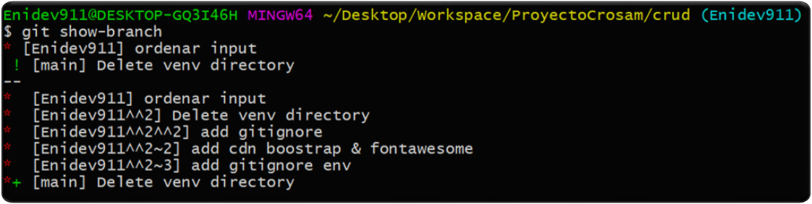
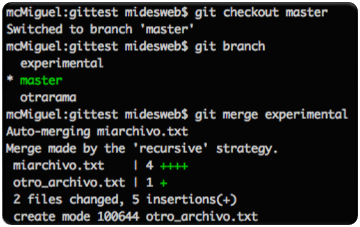

**Crear una rama nueva**  

El procedimiento para crear una nueva rama es sencillo. Usando el comando branch, seguido del nombre de la rama. 

```
git branch nueva
```

Este comando en sí no produce ninguna salida, pero podrías ver las "branches" de un proyecto con el comando "git branch", 
u obtener una descripción más detallada de las ramas con el siguiente comando:  

```
git show-branch
```

Esto nos muestra todas las ramas del proyecto con sus commits realizados.

<p align="center">
    
</p>


**Pasar de una rama a otra**  

Para moverse entre ramas usando el comando "git checkout" seguido del nombre de la rama que queremos que sea la activa.  

```
git checkout nueva
```

Esta sencilla instrucción tiene mucha potencia, porque nos cambiará automáticamente todos los archivos de nuestro proyecto, 
los de todas las carpetas, para que tenga el contenido en el que se encuentra en la correspondiente rama.  

De momento en nuestro ejemplo las dos ramas tenían exactamente el mismo contenido, pero ahora podríamos empezar a hacer cambios en el proyecto experimental 
y sus correspondientes commit y entonces los archivos tendrán códigos diferentes, de modo que puedas ver que al pasar de una rama a otra 
hay cambios en los archivos.  

El comando "checkout" tiene la posibilidad de permitirte crear una rama nueva y moverte a ella en un único paso. Para crear una nueva rama y situarte sobre ella 
tendrás que darle un nombre y usar el parámetro -b  

```
git checkout -b otrarama
```

Como salida obtendrás el mensaje "Switched to a otrarama" y demás en las distintas ramas entonces podrás observar que al moverte de una a otra con checkout el proyecto 
cambia automáticamente en tu editor, mostrando el estado actual en cada una de las ramas donde te estás situando.  

El proyecto puede tener varios estados en un momento dado y tú podrás moverte de uno a otro con total libertad y sin 
tener que cambiar de carpeta ni nada parecido. Si usas un programa de interfaz gráfica de Git, como SourceTree o cualquier otro, 
podrás ver las ramas en un esquema gráfico más entendible que la consola.  

**Fusionar ramas**  

A medidas que crees ramas y cambies el estado de las carpetas o archivos tu proyecto empezará a divergir de una rama a otra. Llegará 
el momento en el que te interese fusionar ramas para poder incorporar el trabajo realizadoa la rama master.  

El proceso de fusionado se conoce como "merge" y puede llegar a ser muy simple o más complejo si se encuentran cambios que GIT no pueda procesar 
de manera automática. Git para procesar el merge usa un antecesor común y comprueba los cambios que se han introducido al proyecto desde entonces, 
combinando el código de ambas ramas.  

Para hacer un merge nos situamos en una rama, en este caso la "master", y decimos con qué otra rama se debe fusionar el códgigo.  
El siguiente comando, lanzado desde la rama "master", permite fusionarla con la rama "nueva".  

```bash
# Situado en rama (master)
git merge nueva
```
Un merge necesita un mensaje, igual que ocurre con los commit, por lo que al realizar ese comando se abrirá "Vim" (o cualquier otro editor de consola que tenga configurado) 
para que introduzcas los comentarios que juzgues oportuno. Para evitar este paso podemos tomar un atajo con el flag -m de la siguiente manera:  

```bash
git merge nueva -m "Esto es un merge con mensaje"
```
En la siguiente imagen puedes ver una secuencia de comandos y su salida. Primero el cambio a la rama master "git checkout master", luego el 
"git branch" para confirmar en qué rama nos encontramos y por último el merge para fusionarla con la rama nueva. 

<p align="center">
    
</p>


