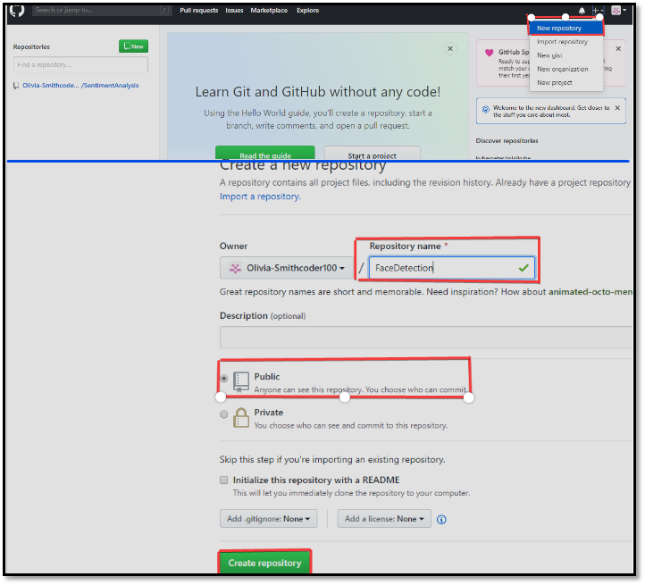

## GIT Push and Pull  

**Git PUSH**  

El comando <b>git push</b> se usa para transferir o enviar la confirmación (commit), que se realiza en una rama local de su computadora a un repositorio remoto como <b>GitHub</b>. El comando utilizado para enviar a GitHub es:  

    git push 'remote_name' 'branch_name'

**Usando la línea de comando para hacer PUSH a GitHub**

1. Creando un nuevo repositorio
    - Debe crear un nuevo repositorio y hacer clic en el signo "+"
    - Complete todos los detalles requeridos, es decir, nombre de repositorio, descripción, y también haga público el repositorio. 

    

2. **Abrá Git Bash.**
    - Git Bash se puede descargar <b><a href="https://git-scm.com/downloads" title="https://git-scm.com/downloads">aquí</a></b> y es un shell que se usa para interactuar con el sistema operativo utilizando comandos UNIX. 

3. **Cree su proyecto local en el escritorio dirigido a un directorio de trabajo actual.** 
    - **pwd** significa <b>('print working directory')</b>, que se utiliza para imprimir el directorio actual.
    - Vaya a la tura específica en su computadora local con el comando <b>cd 'path_name'</b>. El comando cd significa ('changue directory') y se usan para cambiar al directorio de trabajo indicado en 'path_name'. 

4. **Inicializa el repositorio de git
    - Usando el comando <b>git init</b> para inicializar el repositorio local lo que hace es crear una carpeta oculta  <b>.git</b> en el nivel superior de su proyecto, lo que coloca toda la información de revisión en un solo lugar. 

5. **Agregue los archivos al nuevo repositorio local** 
    - Usando el comando <b>(git add .)</b> en su bash para agregar todos los archivos de la carpeta dada.  
    - Usando el comando <b>git status</b>

