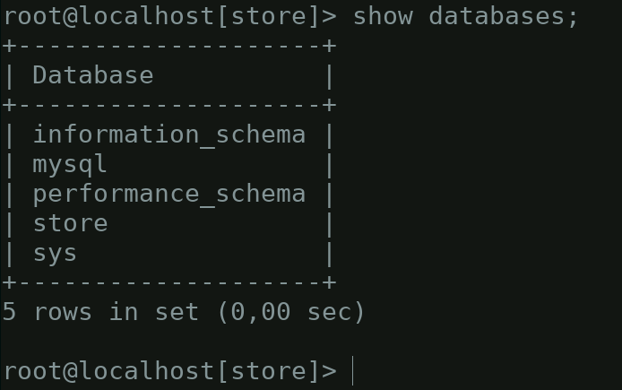

En los sistemas se suele personalizar el **prompt** para ofrecer cierta información a simple vista. En MySQL también lo podemos personalizar mediante la variable de entorno **MYSQL_PS1** o con el parámetro **prompt**.  

Por ejemplo, mediante **MYSQL_PS1="(\u@\h)[\d]> "** indicamos al cliente de **MySQL** que queremos que nos muestre el usuario con el que conectamos, el host al que nos hemos conectado y la base de datos.

Una vez dentro de la sesión interactiva podemos cambiar el prompt usando \R.	 


## Cambiar el prompt en la configuración de MySQL/MariaDB  

Editamos el archivo de configuración de MySQL/MariaDB

```bash
sudo nano /etc/mysql/my.cnf
```

Buscamos la sección mysql y añadimos lo siguiente:  

```
[mysql]
prompt=\\u@\\h [\\d]>\\_
```

<p align="center">
	
</p>


## Algunos ejemplos:  

**Para el usuario** 

ﱲ

**Para el host**  

ﲾ ﳕ ﳖ 

**Para la base de datos**  

⛁ ⛃