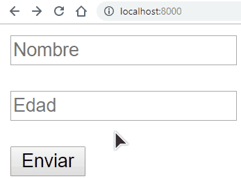

## Procesar formularios en Flask  

para ello vamos a usar el módulo **request** y acceder a **request.form.get**, usando también **render_template** para renderizar las vistas.  

El formulario es muy simple, solo necesitamos la edad y el nombre del usuario. A cada **input** debemos ponerle el tributo **name**, pues a través del mismo vamos a acceder desde Flask.  

```html
<!DOCTYPE html>
<html lang="es">
<head>
    <meta charset="UTF-8">
    <meta name="viewport" content="width=device-width, initial-scale=1.0">
    <meta http-equiv="X-UA-Compatible" content="ie-edge">
    <title>Formulario con flask</title>
</head>
<body>
    <form action="{{url_for('procesar')}}">
        <input type="text" required name="nombre" placeholder="Nombre">
        <br>
        <input type="number" required name="edad" placeholder="Edad">
        <br>
        <input type="submit" value="Enviar">
    </form>
</body>
</html>
```

El método será **POST** y el **action**la ruta que devuelva **url_for**, que no hace otra cosa más que indicar la URL que seguir para una función definida en las rutas, ya veremos en el ejemplo cómo es, por ahora solo recordar que la ruta se llama "procesar".  

Tenemos dos campos, uno con el nombre "edad" y el otro con el nombre "nombre".  
## La app de flask  

Para acceder a este formulario en Flask hay que definir algunas rutas. El código de la app queda como se ve a continuación:  

```python

from flask import Flask, render_template, request

app = Flask(__name__)

@app.route('/')
def inicio():
    render_template('formulario.html')


@app.route('/procesar', methods=['POST'])
def procesar():
    nombre = request.form.get("nombre")
    edad = request.form.get("edad")
    return render_template("mostrar.html", nombre=nombre, edad=edad)

if __name__ == '__main__':
    app.run(host='0.0.0.0', port=8000, debug=True)
```

En la ruta inicio simplemente mostramos el formulario; la magia y el procesamiento del formulario están aquí: 

```py
@app.route('/procesar', methods=['POST'])
def procesar():
    nombre = request.form.get("nombre")
    edad = request.form.get("edad")
    return render_template("mostrar.html", nombre=nombre, edad=edad)
```

La función de la ruta es procesar, justo como lo definimos en el formulario. El único método que acepta es **POST**, pues ese método se usará en el formulario. 

para acceder a los datos del formulario invocamos a **request.form.get("nombre")**

Finalmente renderizamos otra vista pasándole los datos que acabamos de obtener. La vista en cuestión es:  

```html
<!DOCTYPE html>
<html lang="es">
    <head>
        <meta charset="UTF-8">
        <meta name="viewport" content="width=device-width, initial-scale=1.0">
        <meta http-equiv="X-UA-Compatible" content="ie=edge">
        <title>Mostrar resultados</title>
    </head>
    <body>
        <strong>Nombre: </strong>{{nombre}}
        <br>
        <strong>Edad: </strong>{{edad}}
    </body>
</html>
```

Demostración: 

<p align="center">
    
</p>


