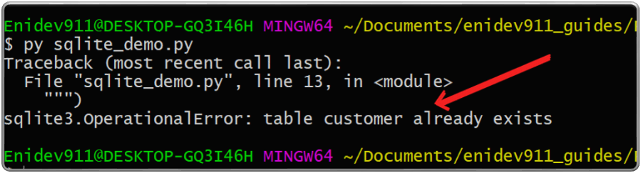

## Crear una clase cliente  

Antes de sumergirnos en el ejemplo CRUD de Python SQLite, digamos que queremos crear una aplicación que maneje los datos del cliente. La aplicación creada debe tener la funcionalidad para crear, actualizar, leer y eliminar clientes. Tenemos que guardar esos datos del cliente en una base de datos para que podamos realizar las operaciones CRUD anteriores desde la base de datos. 

Primero que nada, creemos una clase de Cliente. Nómbrelo como **customer.py**  

```py
# customer.py

class Customer:
    def __init__(self, first_name, last_name, age, city, country):
        self.first_name = first_name
        self.last_name = last_name
        self.age = age
        self.city = city
        self.country = country

    @property
    def email(self):
        return '{}.{}@gmail.com'.format(self.first_name, self.last_name)

    @property
    def fullname(self):
        return '{} {}'.format(self.first_name, self.last_name)

    def __repr__(self):
        return "Customer('{}', '{}', '{}', '{}', '{}')".format(
            self.first_name,
            self.last_name,
            self.age,
            self.city,
            self.country)
```
@property es un decorador incorporado para el iso de captadores y definidores en Python orientado a objetos. He definido dos métodos para el correo electrónico del cliente y el nombre completo del cliente y los marqué como decoradores. Usando el método, puedo obtener la representación del objeto real de la clase de cliente. \_\_repre\_\_  

## Trabajando con SQLite 

Creamos un archivo **sqlite_demo.py**. Toda la funcionalidad relacionada con la base de datos va aquí. En primer lugar, tenemos que importar la biblioteca estándar SQLite3 a nuestro código para que podamos trabajar con las operaciones de la base de datos.  

**Hacer una conexión a una base de datos**  

Necesitamos crear un objeto de conexión para representar nuestra base de datos. En este caso, nuestra base de datos es el **customer.db.sqlite3** tiene un método llamado **connect().** Dentro del método **connect()** podemos pasar un archivo donde queramos almacenar nuestro datos o incluso podemos hacer una base de datos en memoria. 

Este ejemplo muestra una base de datos en memoria:  

```py
import sqlite3

# para usar una base de datos en memoria use ':memory:' como parámetro
# del método connect
connection = sqlite3.connect(':memory:')
```

En este ejemplo nos muestra una conexión a base de datos llamada customer.db  

```py
import sqlite3

connection = sqlite3.connect('customer.db')
```
Si ejecutamos este código, creará un archivo 'customer.db' en nuestro directorio. Incluso si el archivo ya existía. no obtendremos errores la próxima vez que ejecutemos el mismo código.  

**Creando un objeto cursor**  

Un cursor nos permite ejecutar comandos SQL, Podemos crear un cursor ejecutando la función **cursor()** de nuestro objeto de conexión.  

```py
import sqlite3

connection = sqlite3.connect('customer.db')
cursor = connection.cursor()
```
Usando el método del objeto cursor **execute()**, podemos ejecutar comandos SQL.

**Creando la tabla de clientes**  

Usando el objeto cursor, creeemos una tabla de clientes. Tendrá los siguientes campos(columnas):  (first name, last name, city, country, age). 

El comando SQL que queremos ejecutar entrará en el método **execute()** del objeto cursor. Utilizando comillas triples para envolver el comando SQL. Lo llamamos "docstring". El beneficio de usar docstring es que nos permite escribir valores de cadena en varias líneas.  

```py
## sqlite_demo.py
import sqlite3

connection = sqlite3.connect('customer.db')

cursor = connection.cursor()

cursor.execute("""
    CREATE TABLE customer(
        first_name text,
        last_name text,
        age integer,
        city text, 
        country text)
    """)

connection.commit()
connection.close()
```

Ejecutamos nuestro script 'sqlite_demo.py'. Si no obtenemos ningún error, eso significa que hemos creado la tabla de clientes correctamente.  

Si vuelve a ejecutar el mismo código, obtendrá un error similar al siguiente resultado. Eso significa que ya ha creado la tabla de la base de datos.  

<p align="center">
    
</p>


**Insertar datos en la tabla de clientes**  

Ahora que ya hemos creado la tabla de la base de datos, agreguemos datos a la tabla de clientes. Para eso podemos usar el comando "INSERT INTO <table name\> VALUES()".   


```py
## sqlite_demo.py
import sqlite3

connection = sqlite3.connect('customer.db')

cursor = connection.cursor()

cursor.execute("""
    CREATE TABLE customer(
        first_name text,
        last_name text,
        age integer,
        city text, 
        country text)
    """)
cursor.execute("INSER INTO customer VALUES('marco', 'contreras', 30, 'coquimbo', 'Chile')")
connection.commit()
connection.close()
```
Después de crear la tabla de la base de datos, asegúrese de comentar esa parte si agregó la consulta de inserción en el mismo archivo de Python. De lo contrario, obtendrá un error,o añadirle a la instrucción SQL la cláusula "IF NOT EXISTS". 

Para ver que los datos de nuestros clientes se insertan correctamente en la tabla. Para eso, tenemos que escribir una consulta SQL "SELECT" a la tabla "customer".  

**Consultar la tabla de la base de datos**  

Después de insertar los datos, podemos consultar la tabla. En el método **execute()** ponemos lla sentencia "SELECT".  

```py
## sqlite_demo.py
import sqlite3

connection = sqlite3.connect('customer.db')

cursor = connection.cursor()

cursor.execute("""
    CREATE TABLE customer(
        first_name text,
        last_name text,
        age integer,
        city text, 
        country text)
    """)
#cursor.execute("INSER INTO customer VALUES('marco', 'contreras', 30, 'coquimbo', 'Chile')")
cursor.execute("SELECT * FROM customer")
print(cursor.fetchone())
connection.commit()
connection.close()
```

Después del método **execute()**, obtendremos un resultado de consulta para que podamos iterar para encontrar el resultado deseado. hay algunos métodos diferentes para iterar el resultado de la consulta. 


|Método|Funcionalidad|
|------|-------------|
|fetchone()|obtendrá la siguiente fila en nuestro resultado y devolverá un registro. Si no hay más registro disponibles, devuelve None.|
|fetchmany(number)|fetchmany(number) devolverá un número especificado de filas como una lista. Si no hay más registro disponibles, devuelve una lista vacía.|
|fetchall()|Deuvle las filas restantes como una lista que queda. Si no hay filas, devolverá una lista vacía.|


## Utilizando la clase de cliente(customer)  

Primero, importamos la clase de cliente al archivo **sqlite_demo.py**. Ahora, tenemos que crear una instancia(objeto) de una clase de cliente. Crearemos dos instancias y las nombraremos como customer_1 y customer_2:  


```py
import sqlite3
from customer import Customer

connection = sqlite3.connect('customer.db')

cursor = connection.cursor()

cursor.execute("""CREATE TABLE customer(
    first_name text,
    last_name text,
    age integer,
    city text,
    country text
)""")

customer_1 = Customer('john', 'doe', 30, 'perth', 'Australia')
customer_2 = Customer('sara', 'migel', 25, 'perth', 'Australia')

connection.commit()
connection.close()
```

Por ejemplo, digamos que quiero guardar los valores del objeto **customer_1** en la base de datos. Si usamos el fomato de cadena, podemos utilizar las llaves como marcadores de posición. Luego usando el método **format()**, completará esos valores en el marcador de posición correspondiente. 


```py
import sqlite3
from customer import Customer

connection = sqlite3.connect('customer.db')

cursor = connection.cursor()

cursor.execute("""CREATE TABLE customer(
    first_name text,
    last_name text,
    age integer,
    city text,
    country text
)""")

customer_1 = Customer('john', 'doe', 30, 'perth', 'Australia')
customer_2 = Customer('sara', 'migel', 25, 'perth', 'Australia')

cursor.execute("INSERT INTO customer VALUES ('{}', '{}', {}, '{}', '{}')".format(
customer_1.first_name,
customer_1.last_name,
customer_1.age,
customer_1.city,
customer_1.country))

connection.commit()

connection.close()
```
**Nota:** utilizar el formato de cadena no es buena práctica ya que se considera muy propenso a la inyección de SQL.  

**Forma adecuada de agregar un objeto a la base de datos**  

Hay dos formas de insertar objetos en una base de datos correctamente. Dado que el enfoque de formato de cadena es propenso a la inyección SQL, es mejor usar cualquiera de los siguientes métodos.  

1. Marcador de posición que ofrece la DB-API colocando el caracter ?


```py
cursor.execute("INSERT INTO customer VALUES (?,?,?,?,?)",
            (customer_2.first_name, customer_2.last_name,
             customer_2.age,customer_2.city,
             customer_2.country))
connection.commit()
```
Una cosa a tener en cuenta aquí, ya no usamos la función **format()**. En el método de ejecución, pase el segundo argumento como la tupla de valores de objeto que queremos guardar en la base de datos.  

Veamos otro método para lograr la misma funcionalidad que antes.  

Marcador de posición de DB-API a través de claves y valores de diccionario.  

En lugar de usar los "?" como marcador de posición, usamos los dos puntos (:) con un nombre que describe el marcador de posición. En el método de ejecución, tenemos que pasar un diccionario como segundo argumento. Las claves del diccionario serán los nombres de los marcasdores de posición y los valores serán los que pasamos de los atributos del objeto.  

|Marcador|par clave/valor|
|--------|---------------|
|:first|\{'first': customer_1.first_name}|

Usamos corchetes para denotar un diccionario.  


```py
customer_1 = Customer('john', 'doe', 30, 'perth', 'Australia')

cursor.execute("INSERT INTO customer VALUES (:first, :last, :age, :city, :country)", 
{'first':customer_1.first_name, 
'last':customer_1.last_name, 
'age':customer_1.age,
'city':customer_1.city, 
'country':customer_1.country})

connection.commit()
connection.close()
```

**Crear un prototipo de las funciones CRUD con la clase Customer**  

Para demostrar el ejemplo de Python SQLite CRUD, crearé cuatro funciones en el archivo **sqlite_demo.py**.  

1. create_customer(customer)
2. get_customers(city)
3. update_city(customer, city)
4. delete_customer(customer)

Las funciones anteriores son sencillas y hacen lo que han definido.  

**Nota:** A veces es tedioso comprometer nuestras posibilidades cuando hemos realizado las operaciones CRUD en la base de datos. Una forma sencilla de resolver ese problema es utilizar los administradores de contexto de Python. Los administradores de contexto se utilizan para configurar y eliminar recursos automáticamente. Por ejemplo; el objeto de conexión se puede utilizar como administrador de contexto para confirmar y deshacer transacciones automáticamente.  

La palabra clave **with** se utiliza para definir un administrador de contexto. Los administradores de contexto se pueden escribir usando clases o funciones con la ayuda de decoradores.  

*create_customer(customer)*  

La función create_customer(customer) guardará un registro de cliente en la base de datos.  

```py
# import statements
# create connection object
# create database table

def create_customer(customer):
    with connection:
        cursor.execute("INSERT INTO customer VALUES(:first,:last,:age, :city,:country)",
            {'first':customer.first_name,
             'last':customer.last_name,
             'age':customer.age,
             'city':customer.city,
             'country':customer.country})
```

En el código anterior, nuestra función **execute()** del cursor se envuelve dentro del bloque **with**. para que no necesitemos una declaración **commit()** después de eso.  

*get_customers(city)*  

La función get_customers(city) aceptará la ciudad del cliente y devolverá un conjunto de resultados.  

```py
# import statements
# create connection object
# create database table

def get_customers(city):
    cursor.execute("SELECT * FROM customer WHERE city=:city", {'city':city})
    return cursor.fetchall()
```

**Nota:** es posible que se pregunte por qué no hay ningún bloque **with** aquí. Bueno, para la consulta **SELECT no necesitamos la función **commit()**. Debiso a que no necesita estar dentro de un administrador de contexto, si es el **INSERTAR**, **ACTUALIZAR**, **ELIMINAR**, entonces necesitamos un bloque **with**.  


*update_customers(customer, city)*  

La ciudad del cliente se actualizará según el nombre y apellido del cliente proporcionado.  

```py
# import statements
# create connection object
# create database table

def update_city(customer, city):
    with connection:
        cursor.execute("""UPDATE customer SET city=:city
            WHERE first_name=:first AND last_name=:last""",
            {'first': customer.first_name, 'last': customer.last_name,
             'city':city})
```


*delete_customers(customer)*  

Si el nombre y apellido del cliente dado coinciden con los registros existentes de la base de datos, todos los registros con ese nombre se eliminarán de la base de datos.  

```py
# import statements
# create connection object
# create database table

def delete_city(customer):
    with connection:
        cursor.execute("""DELETE FROM customer
            WHERE first_name=:first AND last_name=:last""",
            {'first': customer.first_name, 'last': customer.last_name})
```

Muy bien, hemos implementado toda la funcionalidad CRUD. Ahora ejecutemos nuestro código para ver el resultado.  


Primero que nada, necesitamos crear objetos customer. Crearemos algunos objetos de prueba.  

Luego insertar los clientes en la base de datos usando el método **create_customer(customer)**. Invocamos la función dos veces.  


```py
# import statements
# create connection object
# create database table

def create_customer(customer):
    with connection:
        cursor.execute("INSERT INTO customer VALUES (:first, :last, :age, :city, :country)", 
        {'first':customer.first_name, 'last':customer.last_name,
         'age':customer.age, 'city':customer.city, 'country':customer.country})

def get_customers(city):
    cursor.execute("SELECT * FROM customer WHERE city=:city", {'city':city})
    return cursor.fetchall()

customer_1 = Customer('john', 'doe', 30, 'perth', 'Australia')
customer_2 = Customer('sara', 'migel', 25, 'perth', 'Australia')

create_customer(customer_1)
create_customer(customer_2)

customers = get_customers('perth')

print(customers)

connection.close()
```
Ahora veamos cómo actualizar un cliente y eliminarlo. Tienes que usar las funciones *update_city(customer,city)* y *delete_customer(customer)* para eso.  

```py
# import statements
# create connection object
# create database table

def create_customer(customer):
    with connection:
        cursor.execute("INSERT INTO customer VALUES (:first, :last, :age, :city, :country)", 
        {'first':customer.first_name, 'last':customer.last_name,
         'age':customer.age, 'city':customer.city, 'country':customer.country})
    

def get_customers(city):
    cursor.execute("SELECT * FROM customer WHERE city=:city", {'city':city})
    return cursor.fetchall()

def update_city(customer, city):
    with connection:
        cursor.execute("""UPDATE customer SET city=:city 
        WHERE first_name=:first AND last_name=:last""",
        {'first':customer.first_name, 'last':customer.last_name, 'city':city})

def delete_customer(customer):
    with connection:
        cursor.execute("DELETE FROM customer WHERE first_name=:first AND last_name=:last",
        {'first':customer.first_name,'last':customer.last_name})

customer_1 = Customer('john', 'doe', 30, 'perth', 'Australia')
customer_2 = Customer('sara', 'migel', 25, 'perth', 'Australia')

create_customer(customer_1)
create_customer(customer_2)

update_city(customer_1,'sydney')

delete_customer(customer_2)

print(get_customers('perth'))
print(get_customers('sydney'))

connection.close()
```


    


