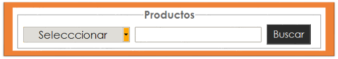

## El widget **LabelFrame**  

El widget **LabelFrame** al igual como el widget **Frame**, es un contenedor especial, un área rectangular que puede contener otros widgets. Sin embargo, a diferencia del widget **Frame** el widget **LabelFrame** le permite mostrar una etíqueta como parte del borde alrededor del área.   

    

  

Para crear un nuevo widget LabelFrame dentro de una ventana padre:  

<code>
    w = tk.LabelFrame(<i>parent, option,...</i>)
</code>

El constructor retorna el nuevo widget **LabelFrame**, Options:  

## Table de opciones.  

|Opción| Descripción|
|------|------------|
|**bg** o **background**| El color de fondo que se mostrará dentro del widget.|
|**bd** o **borderwidth**| Ancho del borde dibujado alrededor del perímetro del widget|
|**height**|La dimensión vertical del nuevo marco. Esto se ignorará a menos que también llame .grid_propagate(0) al marco|
|**hightlightbackground**|Color de resaltado del foco cuando el widget no tiene foco.|
|**hightlightthickness**|Espesor del resaltado de enfoque.|
|**labelanchor**|Utilice esta opción para especificar la posición de la etiqueta en el borde del widget. La posición
predeterminada es 'nw', que coloca la etiqueta en el extremo izquierdo del borde superior del borde superior.
Para conocer las 9 posiciones posibles de las etiquetas, vea el siguiente diagrama:  |
|**labelwidget**|En lugar de una etiqueta de texto, puede usar cualquier widget como etiqueta pasando ese widget como el valor de esta opción. Si proporciona ambas opciones labelwidget y text, la opción text se ignora.|
|**padx**|Utilice esta opción para agregar relleno adicional dentro de los lados izquierdo y derecho del marco del widget. El valor está en píxeles|

