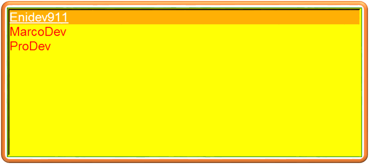

## El widget Listbox  

El propósito de un widget de cuadro de lista es mostrar un conjunto de líneas de texto. Por lo general, están destinados a permitir al usuario seleccionar uno o más elementos de una lista. Todas las líneas de texto usan la misma fuente. Si necesita algo más parecido a un editor de texto, revise la [Sección24, "El widget Text"](#).  

    

Para crear un nuevo widget de cuadro de lista dentro de una ventana o marco raíz *parent*:  

    <code>w = Tk.Listbox(<i>parent, options,...</i>)</code>

  

Este constructor devuelve el nuevo widget **Listbox**.  

Opciones:  

Opciones de widget:  

|Opción|Descripción|
|------|-----------|
|**activestyle**|Esta opción especifica la apariencia de la línea activa. Puede tener cualquiera de estos valores => **underline:** La línea activa está subrayada. Esta es la opción por defecto. **dotbox:** La línea activa está encerrada en una línea de puntos en los cuatro lados. **none:** La línea activa no tiene una apariencia especial.|
|**bg** o **background**|El color de fondo en el cuadro de la lista.|
|**bd** o **borderwidth**|El ancho del borde alrededor del cuadro de lista. El valor predeterminado es de dos píxeles.|
|**cursor**|El cursor que aparece cuando el mouse está sobre el cuadro de lista.|
|**disabledforeground**|El color del texto en el cuadro de lista cuando **state** es tk.DISABLED|
|**exportselection**|De forma predeterminada, el usuario puede seleccionar texto con el mouse y el texto seleccionado se exportará al portapapeles. Para deshabilitar este comportamiento, use **exportselection=0**|
|**font**|La fuente utilizada para el texto en el cuadro de lista.|
|**fg** o **foreground**|El color utilizado para el texto en el cuadro de lista.|
|**height**|Número de lineas (no píxeles) que se muestra en el cuadro de lista. El valor predeterminado es 10|
|**highlightbackground**|Color de resaltado del foco cuando el widget no tiene foco|
|**listvariable**| Una variable de control **StringVar** que está conectado a la lista completa de valores en el cuadro de lista. Si llama al método **.get()** de listvariable, obtendrá una cadena del formulario, donde cada uno es el contenido de una línea del cuadro de lista "('v0', 'v1',...)"vi Para cambiar todo el conjunto de líneas en el cuadro de lista a la vez, llame al método **.set(s)**, donde es una cadena que contiene los valores de línea con espacios entre ellos.  Por ejemplo, si **listCon** está conectado a la opción **listvariable** con **StringVar** esta llamada establecería el cuadro de lista para que contenga tres líneas: **ListCon.set('cigarra hormiga abeja')** esta llamada devolvería la cadena "('cigarra','hotmiga', 'abeja')" con **LisCon.get().**|
|**relief**|Selecciona efectos de sombreado de bordes tridimensionales. El valor predeterminado es **tks.SUNKEN.**|
|**selectbackground**|El color de fondo que se utilizará para mostrar el texto seleccionado.|
|**selectmode**|Determina cuántos elementos se pueden seleccionar y cómo el arrastre del mouse afecta la selección: <ul><li>**tk.BROWSE:** Normalmente, solo puede seleccionar una línea de un cuadro de lista. Si hace clic en el elemento y luego lo arrastra a una línea diferente, la selección seguirá al ratón. Este es el predeterminado</li><li>**tk.SINGLE:** Solo puede seleccionar una línea y no puede arrastrar el mouse; donde sea que haga clic en el botón 1, esa línea está seleccionada.</li><li>**tk.MULTIPLE:** Puede seleccionar cualquier número de líneas a la vez. Al hacer clic en cualquier línea se alterna si está seleccionada o no,</li><li>**tk.EXTENDED:** Puede seleccionar cualquier grupo de líneas adyacentes a la vez haciendo clic en la primera línea y arrastrando hasta la última línea.</li></ul>|
|**state**| De forma predeterminada, un cuadro de lista está en el estado **tk.NORMAL**. Para que el cuadro de lista no responda a los eventos del mouse, establezca esta opción en **tk.DISABLED**|
|**takefocus**|Normalmente, el foco pasará por los widgets de cuadro de lista. Establezca esta opción en 0 - False para sacar el widget de la secuencia.|
|**width**|El ancho del widget en *caracteres* (¡No en píxeles!). El ancho se basa en un carácter promedio, por lo que es posible que añgunas cadenas de esta longitud en fuentes proporcionadas no quepan. El valor predeterminado es 20.|
|**xscrollcommand**|Si desea permitir que el usuario de desplace horizontalmente por el cuadro de lista, puede vincular su widget de cuadro de lista a una barra de desplazamiento horizontal (**Scrollbar**). Establezca esta opción en el método **.set** de la barrar de desplazamiento.|
|**yscrollcommand**|Si desea permitir el desplazamiento verticalmente por el cuadro de lista, puede vincular su widget de cuadro de lista a una barra de desplazamiento vertical. Establezca esta opción en el método **.set** de la barra de desplazamiento.|

