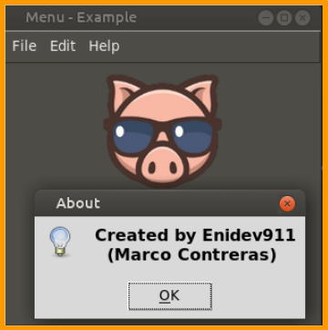

En Tkinter, algunos widgets pueden mostrar imagen como **Label** y **Button**. Estos widgets toman un argumento *image* que les permite mostrar una imagen.  
Sin embargo, no puede simplemente pasar la ruta a un archivo de la imagen al argumento. En su lugar, debemos crear un objeto **PhotoImage** y pasarle el argumento *file* de esta manera.  

```python
photo = tk.PhotoImage(file=path_to_file)
```
Despues de crear el objeto podemos usarlo en otros widget que aceptan el argumento *image*.  

```python
photo = tk.PhotoImage(file='assets/logo.png')
label = tk.Label(window, image=photo)
```
<p align="center">
		
</p>

Actualmente, el widget PhotoImage admite los formatos de archivos GIF, PGM, PPM, PNG a partir de tkinter 8.6. 

Para admitir otros formatos de archivo como JPG, JPEG, o BMP, puede utilizar una librería especializada de imágenes como **Pillow** para convertirlos a un formato que el widget **PhotoImage** comprenda. De hecho, la librería Pillow tiene un widget **PhotoImage** compatible con tkinter ubicado en el módulo **Pil.ImageTk.** 

Para admitir otros formatos