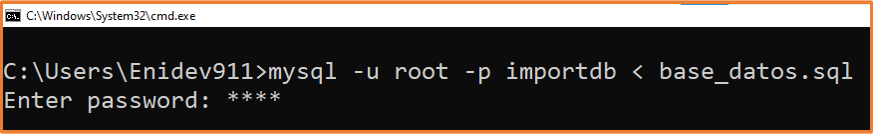

# Exportar e Importar Base de Datos MySQL
**Proceso para exportar e importar una base de datos MySQL desde linea de comandos.**

## <a name='TOC'></a>

1. [Objetivo y descripción](#intro)
1. [Dependencias](#dependencies)
1. [Puesta en marcha](#run)

## <a name='intro'>Objetivo y Descripción</a>

Si bien los clientes de base de datos ( Navycat, MySQLWorkbrench, etc… ) son una excelente herramienta que facilitan la gestión de bases de datos, no siempre tendremos la opción de utilizarlos, por lo que es necesario saber hacer la mayoría de tareas más comunes desde línea de comandos.  **mysqldump** es una pequeña pero muy potente utilidad que acompaña al servidor MySql. Su principal uso es para realizar copias de seguridad de las bases de datos mysql. Con esto en mente, en esta ocasión revisaremos los comandos que nos permitirán exportar e importar una base de datos.

## <a name='dependencies'>Dependencias</a>

- [MySQL](http://www.mysql.com/) - Tener instalado o en su lugar(XAMP, MAMP, LAMP,etc)

## <a name='run'>Puesta en marcha</a>
**Con nuestra Terminal y MySQL corriendo**

## <a name='TOC'></a>

**Exportar**

1. Accedemos a nuestra terminal y ejecutamos el siguiente comando:
```
$ mysqldump -h ip_servidor -u usuario_bd -p base_de_datos > archivo.sql
```
Donde:
  * -h ip_servidor, es el servidor de acceso (generalmente localhost), o la dirección IP del servidor.
  * -u usuario_bd, es el usuario de la base de datos (puede ser root por ejemplo).
  * -p es para que nos pregunte el password.
  * base_de_datos es el nombre de la BBDD a exportar.
  * archivo.sql es el fichero resultante de la exportación, > es para volcar el contenido al archivo con la extensión sql
  
2. Una vez que la ejecución del comando termine, se creará el archivo **archivo.sql** con los querys que crean las tablas e información que pudiera contener nuestra base de datos. 

Ejemplo: 

<p align = 'center'>
  
</p>

Generando un archivo similar a este según sus bases de datos que quieran exportar: 

```sql
-- MySQL dump 10.13  Distrib 5.7.24, for Win32 (AMD64)
--
-- Host: 127.0.0.1    Database: enidevtest
-- ------------------------------------------------------
-- Server version	5.7.24

/*!40101 SET @OLD_CHARACTER_SET_CLIENT=@@CHARACTER_SET_CLIENT */;
/*!40101 SET @OLD_CHARACTER_SET_RESULTS=@@CHARACTER_SET_RESULTS */;
/*!40101 SET @OLD_COLLATION_CONNECTION=@@COLLATION_CONNECTION */;
/*!40101 SET NAMES utf8 */;
/*!40103 SET @OLD_TIME_ZONE=@@TIME_ZONE */;
/*!40103 SET TIME_ZONE='+00:00' */;
/*!40014 SET @OLD_UNIQUE_CHECKS=@@UNIQUE_CHECKS, UNIQUE_CHECKS=0 */;
/*!40014 SET @OLD_FOREIGN_KEY_CHECKS=@@FOREIGN_KEY_CHECKS, FOREIGN_KEY_CHECKS=0 */;
/*!40101 SET @OLD_SQL_MODE=@@SQL_MODE, SQL_MODE='NO_AUTO_VALUE_ON_ZERO' */;
/*!40111 SET @OLD_SQL_NOTES=@@SQL_NOTES, SQL_NOTES=0 */;

--
-- Table structure for table `tareas`
--

DROP TABLE IF EXISTS `tareas`;
/*!40101 SET @saved_cs_client     = @@character_set_client */;
/*!40101 SET character_set_client = utf8 */;
CREATE TABLE `tareas` (
  `id` int(11) NOT NULL AUTO_INCREMENT,
  `nombre` varchar(30) DEFAULT NULL,
  `description` varchar(250) DEFAULT NULL,
  PRIMARY KEY (`id`)
) ENGINE=InnoDB AUTO_INCREMENT=10 DEFAULT CHARSET=utf8;
/*!40101 SET character_set_client = @saved_cs_client */;

/*!40101 SET SQL_MODE=@OLD_SQL_MODE */;
/*!40014 SET FOREIGN_KEY_CHECKS=@OLD_FOREIGN_KEY_CHECKS */;
/*!40014 SET UNIQUE_CHECKS=@OLD_UNIQUE_CHECKS */;
/*!40101 SET CHARACTER_SET_CLIENT=@OLD_CHARACTER_SET_CLIENT */;
/*!40101 SET CHARACTER_SET_RESULTS=@OLD_CHARACTER_SET_RESULTS */;
/*!40101 SET COLLATION_CONNECTION=@OLD_COLLATION_CONNECTION */;
/*!40111 SET SQL_NOTES=@OLD_SQL_NOTES */;

-- Dump completed on 2021-05-13 19:54:42
```

Adicional a esto, podemos ejecutar el mismo comando con las siguientes variaciones:
```
$ mysqldump -h ip_servidor -u usuario_bd -p --no-data=TRUE base_de_datos > archivo.sql
```
Esta variación exporta solo la estructura de la base de datos, sin la información que pudiera contener nuestra base.
```
$ mysqldump -h ip_servidor -u usuario_bd -p --no-create-info=TRUE base_de_datos > archivo.sql
```
Esta variación exporta solo la información de nuestra base de datos, excluyendo la estructura de la misma.

## <a name='TOC'></a>

**Importar**

Para importar una base de datos desde un archivo .sql tenemos dos caminos.

El más sencillo y directo consiste en ejecutar el siguiente comando en la terminal ( asegurándonos que base_de_datos ya exista ).
```
$ mysql -u usuario_mysql -p base_de_datos < archivo.sql
```
Ejemplo: 

Suponiendo que tengamos el siguiente script llamado **base_datos.sql** y previamente tengamos creada una base de datos llamada **importdb**
```sql
CREATE TABLE IF NOT EXISTS contactos (
    id int(11) NOT NULL AUTO_INCREMENT,
    nombre varchar(50),
    apellido varchar(50),
    PRIMARY KEY (id)
);
```
CMD: 

<p align = 'center'>
  
</p>

Obtendriamos lo siguiente al revisar:

<p align = 'center'>
  
</p>


O bien podemos seguir estos pasos:

1. Nos conectamos a la base de datos a donde vamos a importar.
```
$ mysql -h ip_servidor -u usuario -p
```
2. Una vez dentro de la consola MySQL, si la base de datos no existe, la creamos con:
```
mysql> create database base_datos;
```
3. En cualquier caso indicamos la base de datos a usar:
```
mysql> use base_datos;
```
4. Y ahora, el proceso de importación, que sería tan sencillo como ejecutar:
```
mysql> source /home/usuario/archivo.sql
```

PROMPT:

<p align = 'center'>
  
</p>

<p align = 'center'>
  
</p>

