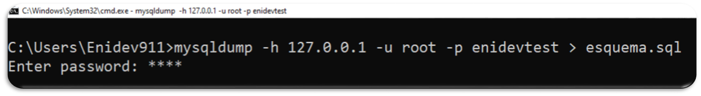

# Exportar e Importar Base de Datos MySQL
**Proceso para exportar e importar una base de datos MySQL desde linea de comandos.**

## <a name='TOC'></a>

1. [Objetivo y descripción](#intro)
1. [Dependencias](#dependencies)
1. [Puesta en marcha](#run)
1. [Referencias](#reference)

## <a name='intro'>Objetivo y Descripción</a>

Si bien los clientes de base de datos ( Navycat, MySQLWorkbrench, etc… ) son una excelente herramienta que facilitan la gestión de bases de datos, no siempre tendremos la opción de utilizarlos, por lo que es necesario saber hacer la mayoría de tareas más comunes desde línea de comandos.  **mysqldump** es una pequeña pero muy potente utilidad que acompaña al servidor MySql. Su principal uso es para realizar copias de seguridad de las bases de datos mysql. Con esto en mente, en esta ocasión revisaremos los comandos que nos permitirán exportar e importar una base de datos.

## <a name='dependencies'>Dependencias</a>

- [MySQL](http://www.mysql.com/) - Tener instalado o en su lugar(XAMP, MAMP, LAMP,etc)

## <a name='run'>Puesta en marcha</a>
**Con nuestra Terminal y MySQL corriendo**

## <a name='TOC'></a>

**Exportar**

1. Accedemos a nuestra terminal y ejecutamos el siguiente comando:
```
$ mysqldump -h ip_servidor -u usuario_bd -p base_de_datos > archivo.sql
```
Donde:
  * -h ip_servidor, es el servidor de acceso (generalmente localhost), o la dirección IP del servidor.
  * -u usuario_bd, es el usuario de la base de datos (puede ser root por ejemplo).
  * -p es para que nos pregunte el password.
  * base_de_datos es el nombre de la BBDD a exportar.
  * archivo.sql es el fichero resultante de la exportación, > es para volcar el contenido al archivo con la extensión sql

Ejemplo: 

<p align = 'center'>
  
</p>

2. Una vez que la ejecución del comando termine, se creará el archivo **archivo.sql** con los querys que crean las tablas e información que pudiera contener nuestra base.

Adicional a esto, podemos ejecutar el mismo comando con las siguientes variaciones:
```
$ mysqldump -h ip_servidor -u usuario_bd -p --no-data=TRUE base_de_datos > archivo.sql
```
Esta variación exporta solo la estructura de la base de datos, sin la información que pudiera contener nuestra base.
```
$ mysqldump -h ip_servidor -u usuario_bd -p --no-create-info=TRUE base_de_datos > archivo.sql
```
Esta variación exporta solo la información de nuestra base de datos, excluyendo la estructura de la misma.

## <a name='TOC'></a>

**Importar**

Para importar una base de datos desde un archivo .sql tenemos dos caminos.

El más sencillo y directo consiste en ejecutar el siguiente comando en la terminal ( asegurándonos que base_de_datos ya exista ).
```
$ mysql -u usuario_mysql -p base_de_datos < archivo.sql
```

O bien podemos seguir estos pasos:

1. Nos conectamos a la base de datos a donde vamos a importar.
```
$ mysql -h ip_servidor -u usuario -p
```
2. Una vez dentro de la consola MySQL, si la base de datos no existe, la creamos con:
```
mysql> create database base_datos;
```
3. En cualquier caso indicamos la base de datos a usar:
```
mysql> use base_datos;
```
4. Y ahora, el proceso de importación, que sería tan sencillo como ejecutar:
```
mysql> source /home/usuario/archivo.sql
```


## <a name='reference'>Referencias</a>

- **Referencia 1:**
	+ [Linux Party](http://www.linux-party.com/index.php/89-basesdedatos/8347-exportar-e-importar-una-base-de-datos-mysql-desde-la-consola-shell-de-linux#)
- **Referencia 2:**
	+ Linea de Comandos
