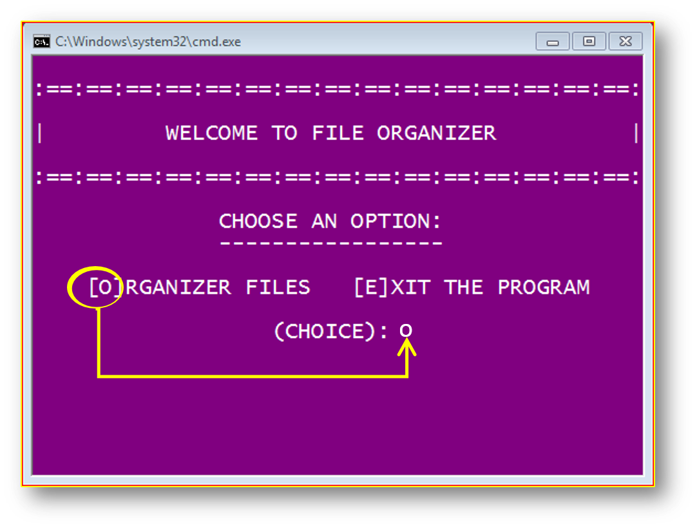

## PythonShell

**console apps with python**  

### *Crud with sqlite3 and Prettytable*

  <a href="./crud_sqlite3">Console crud</a>

### *Crud with csv and Prettytable*

  <a href="./Crud_Csv">Console crud_csv</a>

<h2 align="center">Tools</h2> 

### File organizer

This is a small console tool, to organize your files.

	
	

  <a href="./file_organizer">
	 
  	
  </a>

