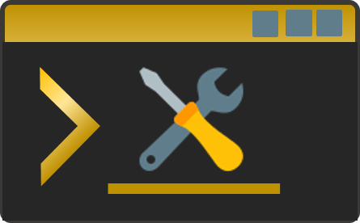
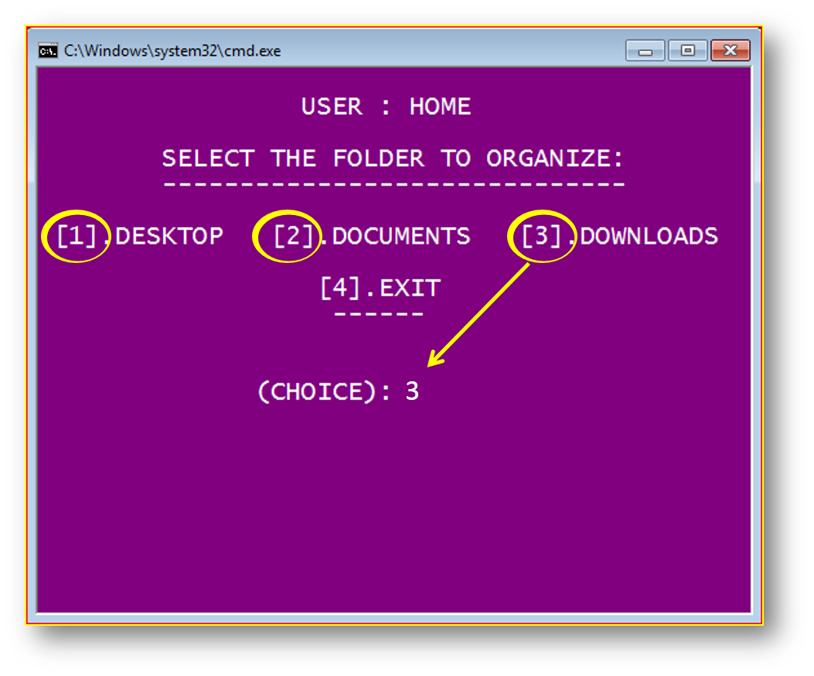

&nbsp;&nbsp;&nbsp;
&nbsp;&nbsp;&nbsp;
&nbsp;&nbsp;&nbsp;

	

<h2 align="center">Tools-Python-Console</h2> 

### File organizer

This is a small console tool, to organize your files.

	
	

  <a href="./tools/file_organizer">
	 
  	
  </a>

