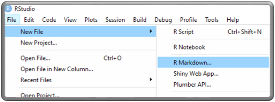
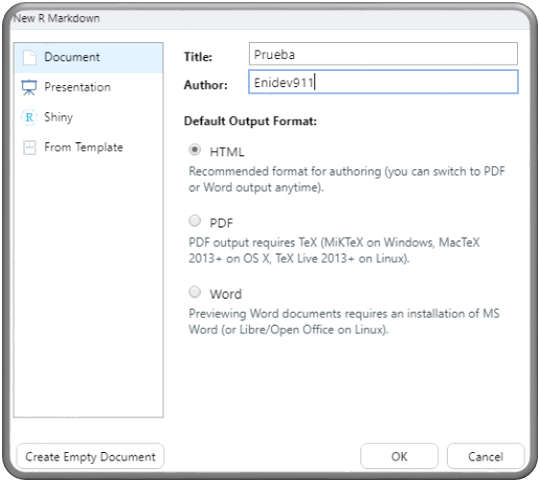
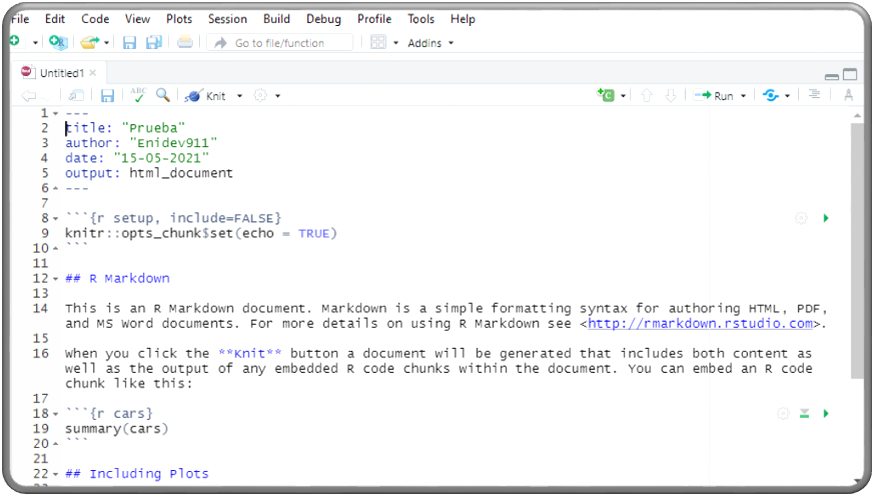
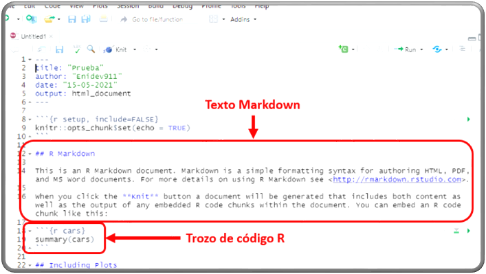
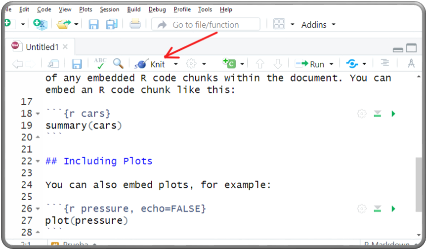
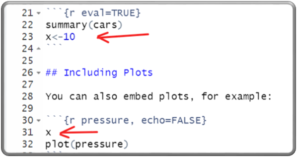
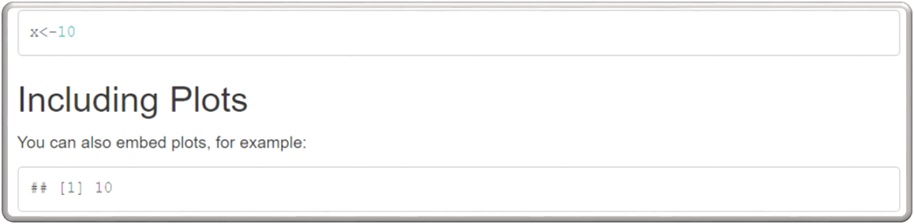

## Crear un nuevo archivo  

    

    

Esto nos genera un template parecido al que se muestra a continuación:

    

Vemos que tenemos texto y código r embebido

    

Veamos guardemos el documento: 

    

Elegimos el destino, y esto comenzara a compilarse.  

Otro punto importante es que podemos elegir mostrar u ocultar el código r de la siguiente manera:  

\`\`\`{r echo=FALSE}  
summary(cars)  
\`\`\`

Poniendo el argumento **echo** en **False**  

Tambien tenemos el argumento **include** lo que hace es incluir o no el resultado y el código:  

\`\`\`{r include=TRUE, echo=FALSE}  
summary(cars)  
\`\`\`

Bien podemos separar los argumentos por una (,) consideremos que si la opción **include** esta en **FALSE** no mostrará el código aunque este la opción **echo** en **TRUE**

Tambien tenemos el argumento **eval** que su valor por defecto es True, lo que hace es evaluar si el código se evalua o no.  

    

tendriamos lo siguiente:  

    

Cabe mencionar que RMarkdown no solo es limitado para embeber código de r, sino también de otros lenguajes

