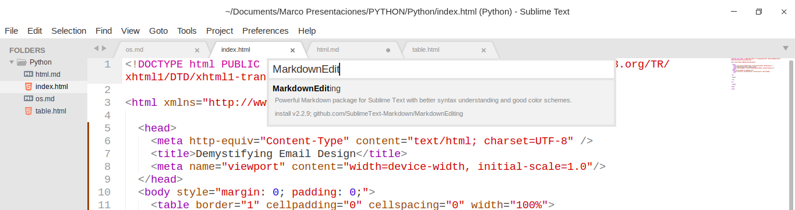
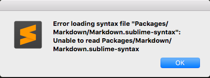
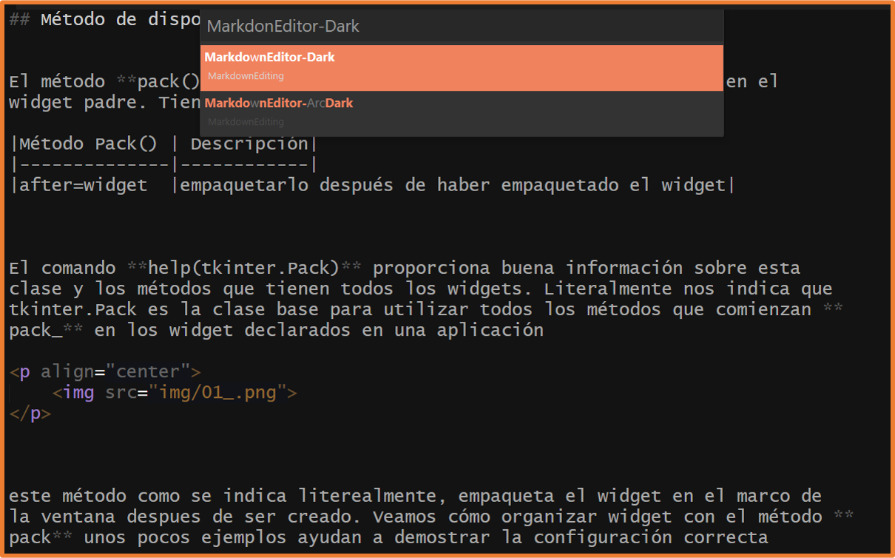
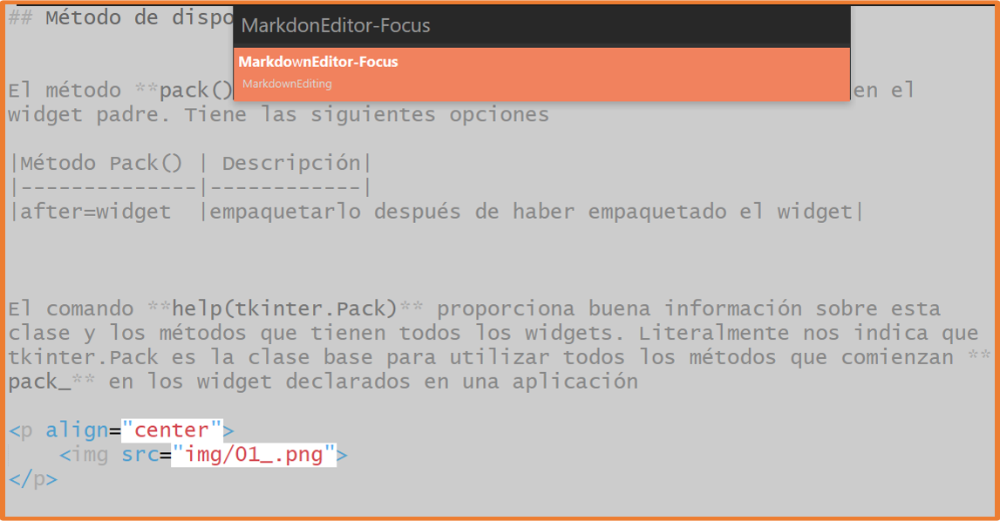
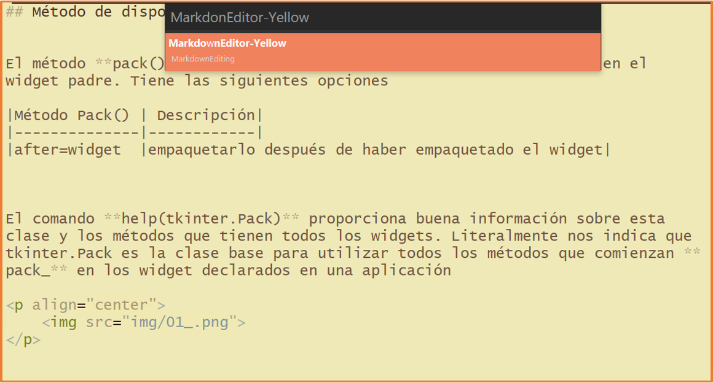
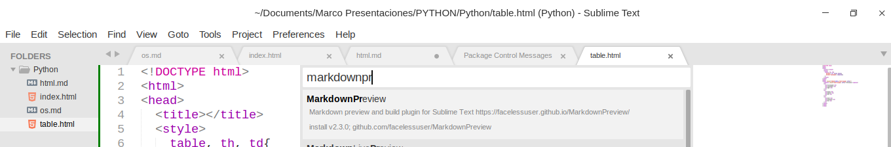

## Cómo configurar ST3 para la edición de Markdown 

Recien instalado, Sublime Text no ofrece ningún soporte específico de Markdown, *sin resaltado de sintaxis*, sin formato especial en cursiva o negrita, sin atajos de teclado y sin vista previa de salida HTML.  
Para agregar estas características debemos instalar algunos complementos y configurar algunas preferencias.  

1. Abrimos package control (CTRL+SHIFT+P)
2. Escribimos install y seleccionamos (Install Package)
3. Escribir el nombre del package (**MarkdownEditing**)  
4. Reinicia SublimeText  


<p align="center">
  
</p>
                                                                 
<p align="center">
  <strong>Nota:</strong> Si esta utilizando ST2 posiblemente al instalarlo te encuentres con una ventana emergente como esta o tambien en ST3. 
</p>

<p align="center">
  
</p>

Esto se debe que cuando descargas el la extensión te cargará automaticamente el README.MD del mismo, por lo que de manera inmediata te arrojará este error, por otro lado, para poder evitar este mensaje de error, para evitar es muy sencillo, vamos a buscar en la barra del menú debemos abrir **Preferences**> **Settings**, y quitamos Markdown de la lista en **"ignored_packages"** en las Preferencias del usuario:

```JSON
// Preferences.sublime-settings -- User
{

"ignored_packages":
  [
  // borramos Markdown de esta lista 
    "Markdown",
    "Vintage",
  ],
 }
```

Simplemente elimine el "Markdown", reinicie ST3  

Despues de reiniciar ST3, todas las funciones del paquete **MarkdownEditing** se aplicarán solo a los archivos con extensión.md.  

## Características de MarkdownEditing  

La extensión instala un atractivo tema gris sobre gris para los archivos Markdown en el editor, Más importante aún, proporciona *formato en línea de Markdown*. Eso significa negritas editor de título, cursivas para palabras envueltas en los simbolos \*\* Las seleccciones marcadas para las citas de bloque y el código fuente también se sombrearán de manera diferente. También se manejará inteligentemente listas de viñetas y listas numeradas, lo que puede ahorrarle mucho tiempo al escribir. Además de eso, ST también incluirá comillas dobles, paréntesis, guiones bajos y astericos(\*) para asegurarse de cerrarlos mientras escribe.  

Personalmente, el esquema de colores que este paquete incorpora por defecto no es malo. Sin embargo, podemos cambiarlo seleccionando otro tema desde el  menú **Preferences**> **Packages Settings**>**Markdown Editing**>**Change color scheme...**

**Capturas** 
<p align="center">
  
  &nbsp;&nbsp;
  
</p>

<p align="center">
  
  &nbsp;&nbsp;&nbsp;
  
</p>

## Atajos que se habilitan junto a MarkdownEditing  

|Combinación|Descripción|
|-----------|-----------|
|**CTRL+1**|Agrega almohadilla para escribir un título (puedes ir desde el 1 al 6)|
|**CTRL+B**|Te compila el archivo de markdown a html(debes tener el build en automatic)|
|**CTRL+D**|Selecciona la palabra en el cursor, luego presiona el asterísco(\*) se convierte en italic si le das dos veces se convierte en bold|
--- 

## Cómo configurar SublimeText para visualizar nuestros archivos de Markdown  
### *MarkdownPreview*  

Ya tenemos instalada la extensión que nos provee la edición de archivos Markdown en SublimeText, esta extensión no tiene alguna forma de ver nuestro archivo específico de Markdown en el navegador, para ello debemos de instalar otro complemento que es fundamental para la previsualización en el navegador este complemento lo buscamos con el nombre de **MarkdownPreview**, este complemento nos ayuda a obtener una vista previa en el navegador de nuestros archivos markdown
  
1. Abrimos package control (CTRL+SHIFT+P)
2. Escribimos install y seleccionamos (Install Package)
3. Escribir el nombre del package (**MarkdownPreview**)  
4. Reinicia SublimeText 

<p align="center">
  
</p>

Para aprovechar su capacidad podemos configurar un atajo de teclado de la siguiente manera:

Vamos a **Preferences** ->**Key Bindings - User** y añadimos entre los corchetes lo siguiente.
```json
{ "keys": ["alt+m"], "command": "markdown_preview", "args": {"target": "browser", "parser":"markdown"} }
```
Salvamos cambios con **Ctrl + S**
