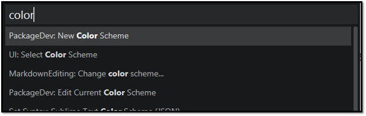
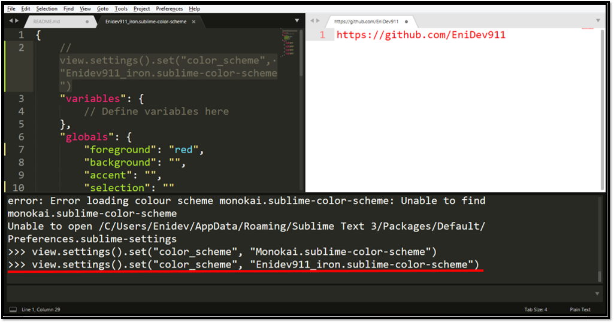
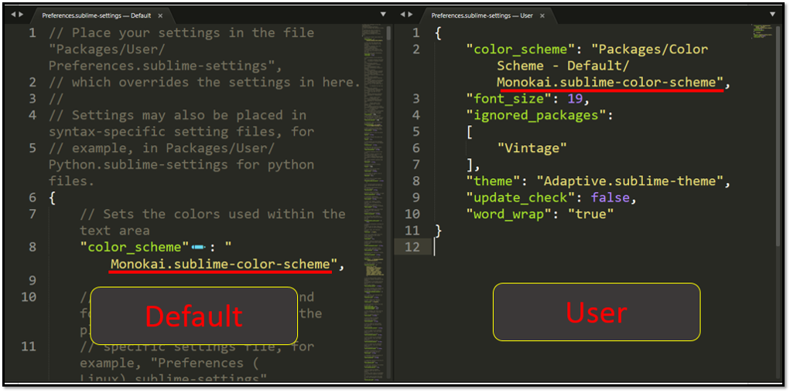
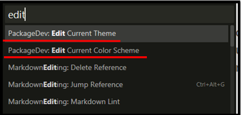
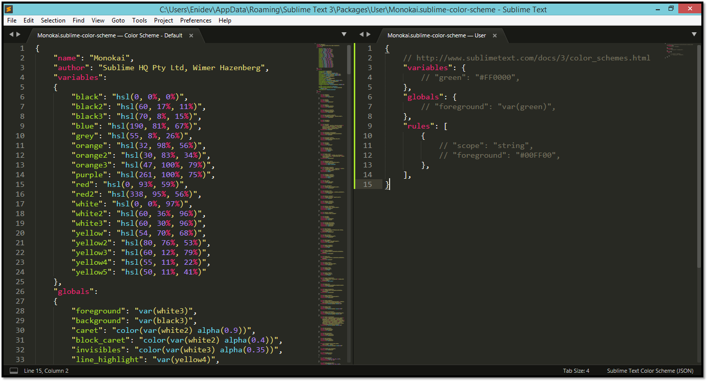

## Crear un color-scheme fácilmente  

Para ello vamos a instalar un paquete llamado **PackageDev** y presionamos **Ctrl+P** y le damos en la siguiente opción:  

<p align="center">
    
</p>

Esto nos carga ya un archivo JSON listo para trabajar con las claves que se utilizan para la configuración de el nuevo esquema, la otra ventaja que tiene este método es que el archivo ofrece automáticamente guardarlo en el paquete de usuario para que pueda estar disponible, recuerde que es importante que le demos la extensión **.sublime-color-scheme (ej: Enidev911_iron.sublime-color-scheme)** 

```json
{
    "variables": {
        // Define variables here
    },
    "globals": {
        "foreground": "", // color del texto para el esquema
        "background": "", // color de fondo para el esquema
        "accent": "", // color del cursor
        "selection": "", // color al seleccionar texto
    },
    "rules": [
        {
            "scope": "string",
            "foreground": "",
        },
        {
            "scope": "variable",
            "foreground": "",
        },
        {
            "scope": "keyword",
            "foreground": "",
        },
        {
            "scope": "constant",
            "foreground": "",
        },
    ]
}
```

El siguiente paso ya que tenemos guardado nuestro archivo, es agregar los valores para establecer las nuevas reglas de estilo para nuestro esquema, podemos basarnos en otro esquema que ya exista para tomarlo de referencia, una forma comoda de trabajar es dividir la pantalla para ir viendo los cambios cada vez que hagamos cambios, presionando la combinación **Alt+Shift+2** una vez hecho esto abrimos la consola con **Ctrl+Ñ** y nos posicionamos en la segunda pantalla para poder setiar el esquema que queremos ver, colocamos lo siguiente:  

```
view.settings().set("color_scheme", "Tu_esquema.sublime-color-scheme")
```

Ejemplo: 

<p align="center">
    
</p>


Si quiere saber toda la lista de globales que puede usar para comenzar a marcar el esquema, vaya a la <a href="https://www.sublimetext.com/docs/color_schemes.html">Documentación</a>  y desde allí comenzar a crear su propio esquema desde 0, pero en este caso vamos a trabajar viendo otro esquema existente, vamos al menú superior y vamos a la opción **Preferences**->**Settings** veremos algo como esto:  

<p align="center">
    
</p>

Como vemos las configuraciones a la izquierda son las por defecto y en el otro lado están las configuraciones de usuario, cabe destacar que las configuraciones de usuario sobrescriben a las por defecto ese punto es muy importante tenerlo en cuenta ya que en nuestro caso lo que haremos es crear un nuevo archivo con el nombre del esquema **Monokai** el cual tendra la extensión que ya sabemos que es para que sea identificado por SublimeText, así podremos conservar todas las reglas del esquema por defecto y alterar las que nosotros consideremos pertinentes. Esto es un poco complejo ya que nos obliga aprendernos los nombres de los esquema y estar revisando la documentación para ver que regla aplicar, lo bueno que nuevamente el paquete **DevPackage** esta para ayudarnos con esto de una manera muy sencilla, solo debemos seleccionar el esquema que queramos alterar y presionando la combinación **Ctrl+P** escribimos edit:  

Ej:  
<p align="center">
    
</p>

Y se nos abrirá lo siguiente lo cual es algo que ya conocemos y solo nos queda poder modificar y viendo el archivo base a la vista, como vemos funciona de la misma manera tanto para editar un esquema o un tema.  

<p align="center">
    
</p>

Vemos que ni siquiera es necesario guardar el archivo, ya que lo crea en el directorio de usuario con su nombre y extensión correspondiente y los cambios se pueden ver directamente ya si reescribimos algunas de las variables ya existentes.