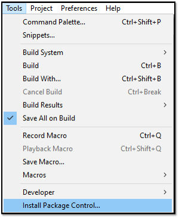
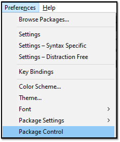
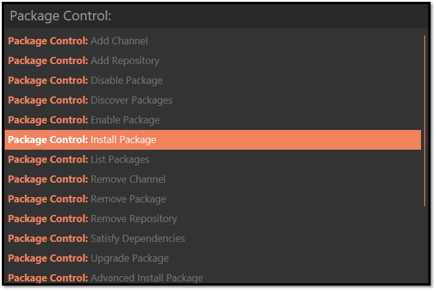

## Enidev911  

**Métodos de instalación**

- [Instalación local](#istall)
- [Instalación Portable](#portableinstall)

Esta guía te va ayudar a como configurar SublimeText 3 para adaptarlo a tus necesidades esta compuesto por los siguientes temas:  

##   

1. [ST3 para Markdown](ST3_edit_markdown/README.md)
1. [ST3 atajos de teclado](./ST3_shorcuts_effective/README.md)
1. [ST3 crear esquema personalizado](Color-Scheme/README.md)

## <a name="intro">Descripción</a>  

Si bien en el mundo del desarrollo de Software una de las herramientas fundamentales para los desarrolladores son los entornos de desarrollo integrados (IDE) y los editores de códigos más tradicionales (como Vim, Nano, Notepad, Gedit) siendo los primeros más completos con muchas funcionalidades que te brindan productividad y herramientas como el "Debugging" a costo de que estos consumen mayor espacio en la memoría ram al cargarse todos las funciones que lo componen y suelen pesar bastante a la hora de instalarse así que si tu computadora es de recursos limitados no tendrás la mejor experiencia, por otro lado tenemos los editores los cuáles tenemos una gran variedad en el mercado como (Visual Studio Code, SublimeText, Notepad++) estos últimos particularmente son bastante flexibles a la hora de trabajar con ellos podemos extender sus capacidades a través de plugin y convertirlos en un verdadero IDE, entre los más buscados por los desarrolladores está Visual Studio Code ya que es un producto de Microsoft y completamente Open Source, su rendimiento es muy aceptable y goza de constantes actualizaciones que hacen que su rendimiento sea más optimo. No siempre hay que despreciar el resto de los editores ahora en esta guía nos basaremos en como utilizar el editor que para mí es sin duda uno de mis mejores herramientas la cual me ha acompañado durante mucho tiempo y se trata de SublimeText, es un editor de los más flexible que existen y personalizable y lo mejor es que es un editor demasiado ligero que independiente de la computadora que lo ejecuta la experiencia es muy fluida, tiene unos atajos de teclado que son pensados para que te sientas Usaint Bold ejecutando tareas dentro del mismo editor un punto negativo se podría considerar es que este software es de pago, o sea se debe comprar una licencia para su uso, sin embargo no es una limitación de funcionalidad el que no la tengamos, lo unico que sucederá que de vez en cuando te va a mostrar una ventana emergente que te va a recordar de obtener una licencia.  

## <a name="install">Instalación</a>  

- <a href="http://sublimetext.com/download" target="_blank">Descarga oficial</a>

Una vez instalado, el siguiente paso es obligatorio para poder seguir los topicos de esta guía ya que en ocasiones debemoremos instalar paquetes de terceros para extender la funcionalidad de este editor, debemos instalar lo que se conoce como un administrador de paquetes (**Package control**) es un paso muy sencillo, solo debemos ir en el menú superior y buscar **Tools** -> **Install Package Control**  

    

Hecho esto ahora se nos habilitará una nueva opción **Preferences** del menu superior:  

    

Ahora tenemos package control listo para gestionar la instalación de nuevos plugín así mismo como elimarlos o re-instalarlos:  

    

##   

