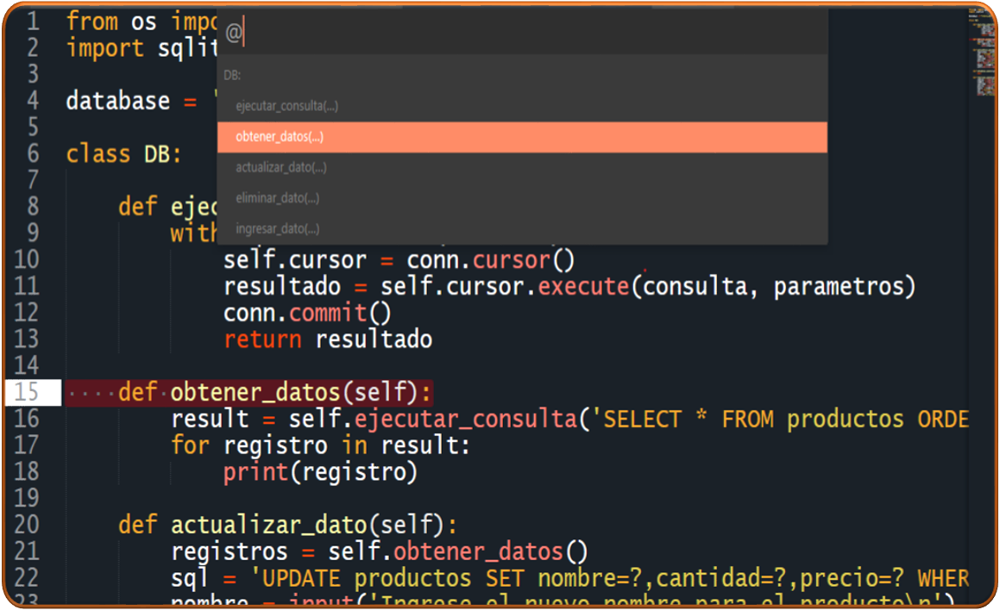
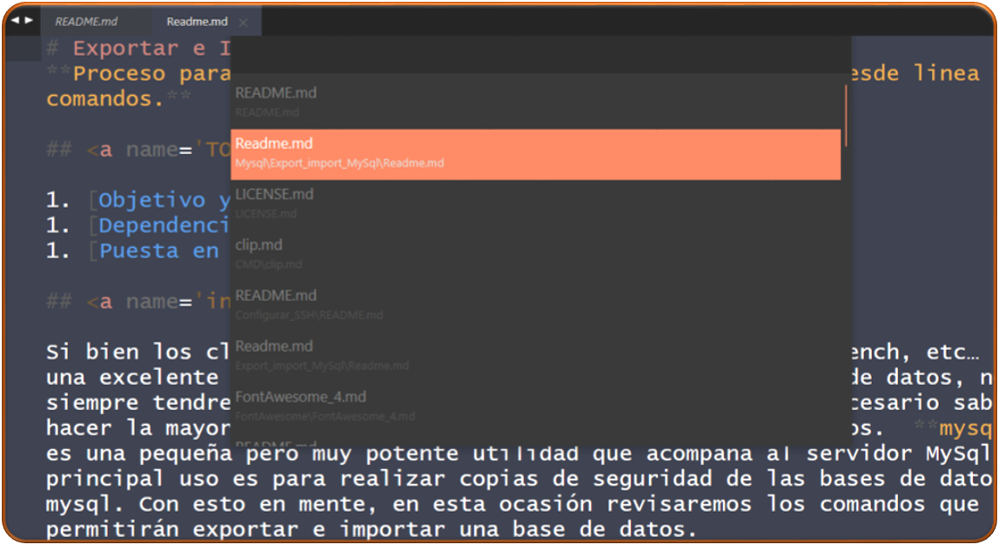
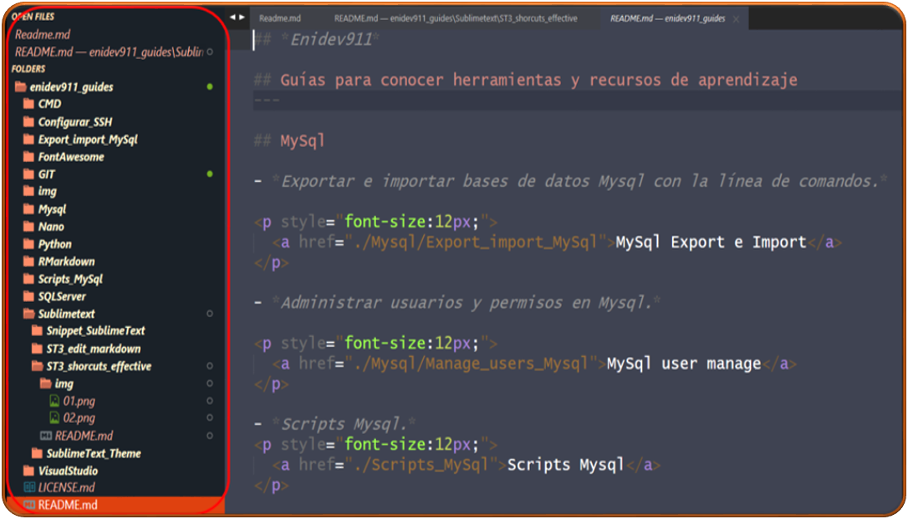

## Ir a cualquier lugar  

Los IDE tienen una tecla de atajo para ir a un nombre de clase, una diferente para ir a un nombre de función y otra para símbolos. Esto puede causar mucha confusión sobre cómo navegar por un archivo.  

Para Sublime Text, todo lo que tiene que hacer es presionar **Ctrl + R** para navegar a cualquier función/clase/símbolo en el archivo que está editando actualmente.  

    

## Abra cualquier archivo 

Sublime Text le permite ir a cualquier nombre de archivo con bastante rapidez. Simplemente presione **Ctrl + P** para abrir cualquier archivo de su espacio de trabajo. 

    

## Mostrar / Ocultar barra lateral  

Pulsando las teclas siguientes en la sucesión **Ctrl+K** y **Ctrl+B**  

    

## Duplicar líneas.  

Duplicar línea actual: **Ctrl + Shift +D**
Cortar línea actual: **Ctrl + X**
Pegar: **Ctrl + V**  

## Ir a número de línea  

Los reportes o registradores de errores siempre lo dirigen a un número de línea específico en cualquier archivo dado. Pulse **Ctrl + G** para ir a cualquier número de línea dado.

## Varios cursores 

Primero, seleccione cualquier palabra o palabras que desee editar. Luego presione **Ctrl + D** para seleccionar la ocurrencia de la palabra seleccionada una por una. También puede presionar **Alt + F3** para seleccionar todas las apariciones de la palabra en un archivo determinado.  

**Corrector ortográfico**  

Presionando F6 para alternar el corrector ortográfico en Sublime Text.  

**Mover la línea hacia arriba y abajo**  

**Ctrl + Shif + Up** o **Ctrl + Shif + Down**

**Escribir en la línea siguiente de la posición actual**  
**Ctrl + Enter** 

**Abrir consola de ST3** 

Abrir la consola nos permite comunicarnos con la API de ST3

**Ctrl+Ñ** 

