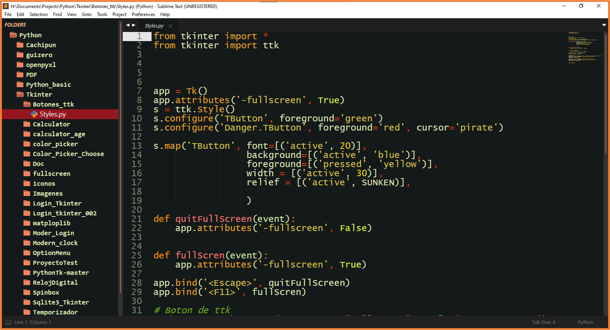
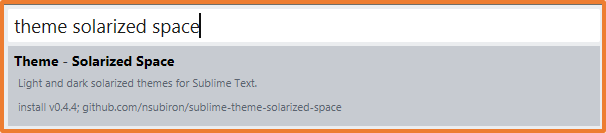
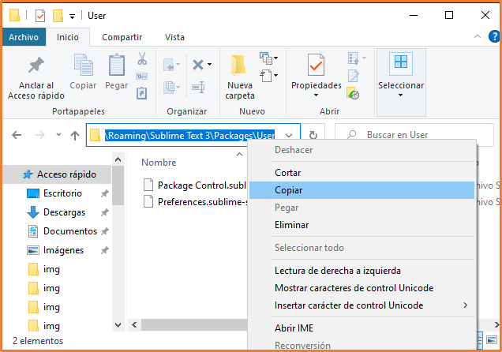
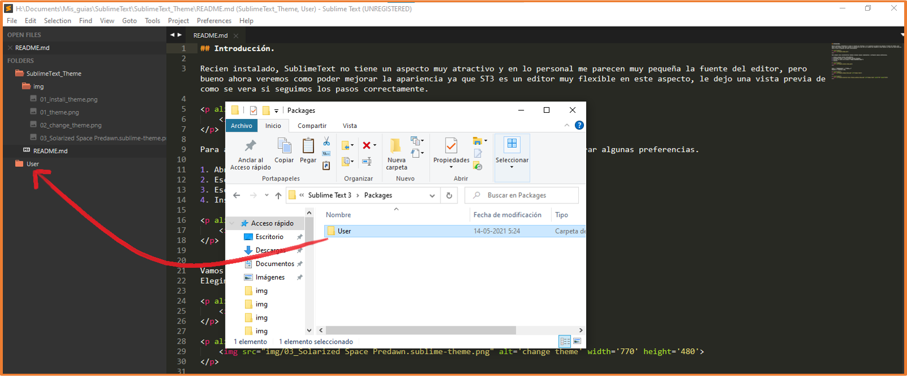

## Introducción.

Recien instalado, SublimeText no tiene un aspecto muy atractivo y en lo personal me parecen muy pequeña la fuente del editor, pero bueno ahora veremos como poder mejorar la apariencia ya que ST3 es un editor muy flexible en este aspecto, le dejo una vista previa de como se vera si seguimos los pasos correctamente.  

<p align="center">
    
</p>

Para agregar estas características debemos instalar algunos complementos y configurar algunas preferencias.  

1. Abrimos package control (CTRL+SHIFT+P)
2. Escribimos install y seleccionamos (Install Package)
3. Escribir el nombre del package (**theme solarized space**)  
4. Instalar

<p align="center">
    
</p>


Vamos a **Preferences** ->**Theme...**  
Elegimos el siguiente tema.  

<p align="center">
    
</p>

<p align="center">
    
</p>

Para poder modificar la apariencia debemos crear un nuevo archivo en nuestro directorio de configuraciones de usuario una forma fácil de poder abrirlo es:  
Vamos a **Preferences** ->**Browse Packages...** 

Se le abrira una modal de navegación justamente en donde se encuentra nuestra carpeta de usuario, entramos en ella y copiamos la dirección en la barra de navegación:

<p align="center">
    
</p>

Teniendo la dirección copiada en el portapapeles lo siguiente será retroceder una carpeta y arrastrar la carpeta **user** hacia la barra lateral del editor de la siguiente manera.  

<p align="center">
    
</p>


Ahora creamos un nuevo archivo y le damos a guardar:

<p align="center">
  
     &nbsp;&nbsp;&nbsp;&nbsp;&nbsp;
  
</p>

**IMPORTANTE** 

Cuando se abra la modal pegamos la dirección que tenemos en el portapeles, y lo más importante es guardar el archivo con el nombre del tema con la extensión **sublime-theme** ya que sobreescribiremos los estilos por defecto.
**Solarized Space Predawn.sublime-theme**

<p align="center">
    
</p>

Y dentro del archivo pegamos el siguiente código  

```json
[
    {
        "class": "sidebar_label",
        "color":[255, 170, 150],
        "font.face": "Segoe UI",
        "font.italic": true,
        "font.size": 15,
    },
    {
        "class": "sidebar_label",
        "parents": [{"class": "tree_row", "attributes":["hover"]}],
        "color": [10, 240, 200],
    },
    {
        // Configuración para el archivo seleccionado
        "class": "sidebar_label",
        "parents": [{"class": "tree_row","attributes": ["selected"]}],
        "color": [255, 255, 255], 
        "font.italic":false
    },
     {
        "class": "sidebar_label",
        "parents": [{"class": "tree_row","attributes": ["selected", "hover"]}],
        "color": [255, 255, 70],
  
    },
       // Sidebar heading
    {
        "class": "sidebar_heading",
        "color": [255, 170, 130],
        "shadow_color": [105, 109, 118, 35],
        "shadow_offset": [0, 0.1],
        "font.bold": true,
        "font.italic":true,
    },
      // Sidebar container
    {
        "class": "sidebar_container",
        "layer0.texture": "",
        "layer0.opacity": 10,
        "layer0.tint": [20, 25, 25],
    },
        // Sidebar tree
    {
        "class": "sidebar_tree",
        "row_padding": [6,3],
        "indent": 15,
        "indent_offset": 12,
        "indent_top_level": false,
        "dark_content": true,
    },
        // Sidebar row selected
    {
        "class": "tree_row",
        "attributes": ["selected"],
        "layer0.opacity": 100, // Transparencia para el bg seleccionado
        "layer0.tint": [230, 20, 35], // Color del background
         "font.italic":false,
    },
    // Sidebar folder entry
    {
        "class": "sidebar_label",
        "parents": [{"class": "tree_row","attributes": ["expandable"]}],
        "color": [220, 240, 180],
        "font.bold":true,
        "font.italic":false,
        "font.face": "Consolas",

    },

]

```

Salvamos los cambios con **Ctrl + S**

Deberiamos obtener el siguiente resultado: 

<p align="center">
    
</p>

Cambiemos la fuente y la escala del editor.  
Vamos a **Preferences** ->**Settings**  

Y pegamos lo siguiente en el apartado de las configuraciones del usuario:

```json
{

    "font_face": "Lucida Console",
    "font_size": 15,
    "ignored_packages":
    [
        "Vintage"
    ],
    "theme": "Solarized Space Predawn.sublime-theme",
    "ui_scale": 1.2
}

```
<p align="center">
    
</p>

Reiniciamos el editor y veremos que ya nuestra fuente así como nuestra barra laterar al aumentado su escala.
Por último instalamos la extensión para tener los iconos  

1. Abrimos package control (CTRL+SHIFT+P)
2. Escribimos install y seleccionamos (Install Package)
3. Escribir el nombre del package (**A File Icon**)  
4. Instalar

