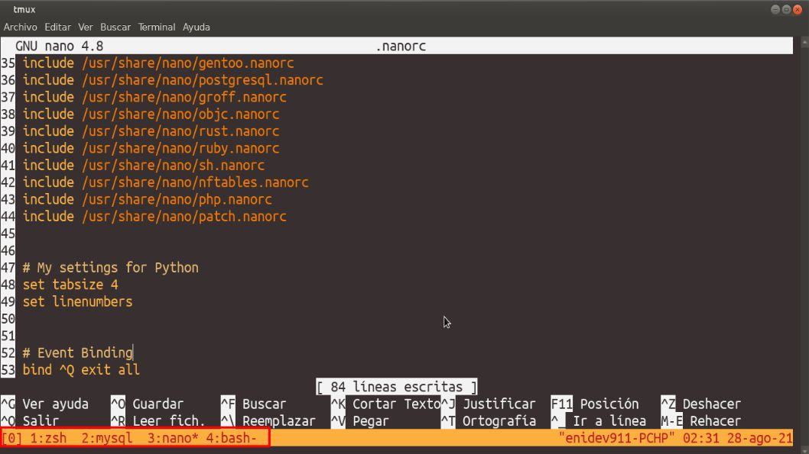

## tmux: Terminal Multiplexer  

tmux es otra herramienta que se convierte en imprescindible una vez que descubres que existe.  

tmux te permite lanzar múltiples terminales (ventanas y paneles) dentro de una única pantalla y cada terminal es totalmente gestionable y separada de las demás.  

la siguiente captura ilustra una sesión de tmux con 4 ventanas, siendo la ventana activa la 2.  


# image

## Instalando tmux  

Podemos instalar tmux desde nuestro gestor de paquetes de preferido.  

**Debian, Ubuntu, Mint**  

```bash
apt-get install tmux
```
**CentOS, RedHat, Fedora**  

```bash
yum install tmux
```

**Gentoo**  

```bash
emerge tmux
```

## Funcionalidad básica de tmux  

Antes de entrar en materia, y para quien no conozca screen, vamos a ver algún ejemplo de sesión típica de tmux: ejecutaremos el programa, crearemos múltiples terminales y usaremos algunas de las funciones básicas e imprescindibles (como el detach).  

Para eso, comenzaremos creando un archivo de configuración **.tmux.conf** en nustro directorio **$HOME** que contenga lo siguiente:  

```bash
# Disparador adicional para tmux versión menor a 1.6
#set-option -g prefix C-a,C-b

#Disparador adicional ara tmux versión mayor a 1.6
set-option -g prefix C-a
set-option -g prefix2 C-b


# Empezar la numeración de las ventanas creadas en 1 (la primera ventana)
set -g base-index 1
```

## Ejecutando y utilizar tmux 

Para lanzar tmux, simplemente escribimos **tmux** en la terminal de turno. Se creará en la pantalla actual una nueva sesión de tmux que contendrá las diferentes terminales que vallamos creando:  

<p align="center">
	
</p>

En la parte inferior izquierda podemos ver las diferentes terminales que tenemos creada y el simbolo (*) marca la terminal que esta activa. 

Si queremos lanzar tmux directamente dándole un nombre a nuestra sesión (por si vamos abrir varios) podemos hacerlo de la siguiente manera:  

```bash
tmux new -s "Nombre sesión"
```


Para realizar las diferentes acciones, se utiliza un atajo de teclado que permite enviarles comandos a tmux para crear, eliminar o dividir terminales en la ventana (paneles), o movernos a la anterior o siguiente.  

|Atajo|Acción|
|-----|------|
|**Ctrl+B c**|Crear una nueva ventana (c de create).|
|**Ctrl+B n**|Cambiar a la ventana siguiente (n de next).|
|**Ctrl+B p**|Cambiar a la ventana anterior (p de previous).|
|**Ctrl+B &**|Cerrar la ventana actual (aunque si hacemos un exit se cierra).|

Estas combinaciones de teclas se realizan pulsando **Ctrl+B**, soltando dichas tecla y pulsando después la tecla del comando deseado (Para ello previamente debemos tener inicializado tmux escribiendo el comando **tmux** en la consola).  

