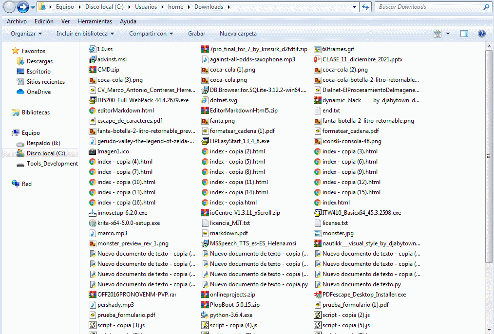

## Description


This is a small console tool, to organize your directories that accumulate more files in a disorganized way we talk about: 

- **"The Desktop"**
- **"Documents"**
- **"Downloads"**

It is designed more for windows, although with some time I will be able to add new functionalities for make it cross-platform.


## Content

This console tool is composed of two scripts `main.py` and `organizer.py`. It is quite easy to understand it since the organize function is in the organizer module and the main function that shows the menus is `main.py`


## Run

This tool does not need to install any external library.


```
python main.py
```


## Demo


<p align="center">
	
</p>